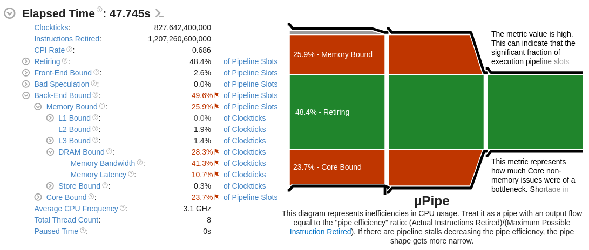
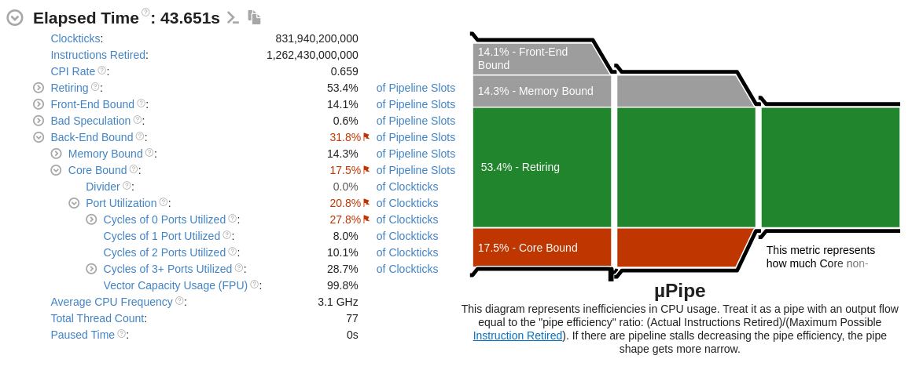
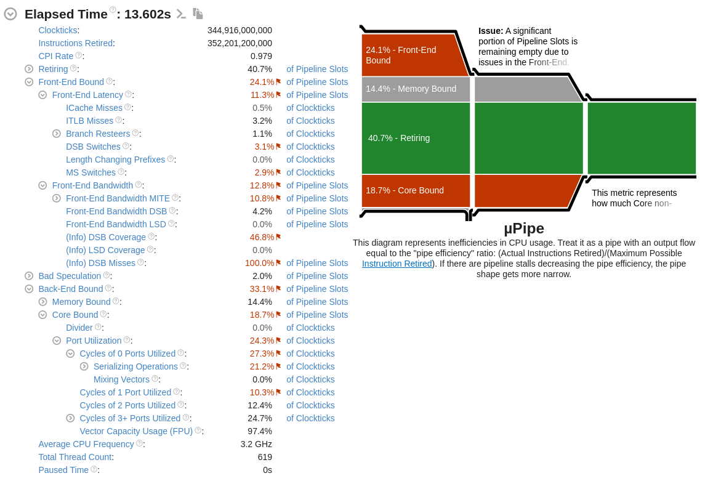

# Performance Tweaks

`suanPan` prioritizes performance and designs the analysis logic in a parallel context accordingly.

Although the majority of analyses of common types can be parallelized, there are still certain parts that have 
strong data dependencies that cannot be parallelized.
The speed-up factor is mostly determined by the serial code.
According to [Amdahl's law](https://en.wikipedia.org/wiki/Amdahl%27s_law), there would be an upper bound of the 
theoretical speed-up.

## Benchmark

Benchmarking is hard.
Here we try to present a baseline of performance on recent PCs.

There is a `benchmark` command that is designed to benchmark the platform by solving a large matrix repeatedly.
The following is the main implementation.
The matrix occupies 200 MB of memory.
It is large enough to account for potential memory bandwidth bottleneck.
It effectively reports the performance of `dgesv` subroutine in `LAPACK`.

```cpp
int benchmark() {
    constexpr auto N = 50;
    constexpr auto M = 5120;

    const mat A = mat(M, M, fill::randu) + eye(M, M);
    const vec b(M, fill::randu);

    for(auto I = 1; I <= N; ++I) {
        vec x = solve(A, b);
        x(randi<uvec>(1, distr_param(0, M - 1))).fill(I);
    }

    return SUANPAN_SUCCESS;
}
```

As FEM is essentially solving large matrices, such a benchmark is practical and close to actually performance.
Profiling it on an average laptop yields the following result.
This particular platform is able to achieve a CPI (cycles per instruction) of 0.686.
This serves as the baseline and upper bound of practical performance.



### Large-sized Elastic Analysis

[This example](https://github.com/TLCFEM/suanPan/tree/dev/Example/Misc/DKTS3) is a linear elastic analysis.
There are 20124 nodes and 39990 shell elements in total, and since each node has six DoFs, there are in total 120744 DoFs.

Because an elastic material model is used, element state updating is trivial, requires only matrix multiplication.
The main computation is assembling the global stiffness matrix and solving it.
Profiling this example on the same platform yields the following result.
It is able to achieve a CPI close to the baseline.



### Medium-sized Plastic Analysis

[This example](../Example/Geotechnical/slope-analysis.md) contains 2990 nodes, and uses a plastic material model.
Element state updating now involves local plasticity integration.
It is able to achieve a CPI of 0.979 in this case.



Assuming all (or at least the majority of) instructions are *useful* instructions, one can conclude that decent performance can be practically achieved, even when the problem size is not significantly large.

## Analysis Configurations

Here are some tips that may improve the performance.

1.  If the analysis is known to be linear elastic, use `set linear_system true` to skip convergence test and iteration.
    Note the analysis should be both material and geometric linear.
2.  If the global system is known to be symmetric, use `set symm_mat true` to use a symmetric storage.
    Analyses involving 1D materials are mostly (**_not always_**) symmetric.
    Analyses involving 2D and 3D materials are mostly (**_not always_**) **_not_** symmetric.
3.  Consider a proper stepping strategy. A fixed stepping size may be unnecessarily expensive.
    A proper adaptive stepping strategy can significantly improve the performance.
4.  Prefer a dense solver over a sparse solver if the system is small.
    A dense solver is generally faster than a sparse solver for small systems.
5.  Prefer a mixed-precision algorithm `set precision mixed` over a full-precision algorithm if the system is large.
    A mixed-precision algorithm is generally faster than a full-precision algorithm for large systems.
    See following for details.
6.  The performance of various sparser solver can vary significantly.
    It is recommended to try different solvers to find the best one.

## Mixed-Precision Algorithm

On some platforms, the performance of the mixed-precision algorithm can be significantly better than the full-precision
algorithm.
The mixed-precision algorithm converts the full-precision matrix to a lower precision matrix, and then solves the system
using the lower precision matrix.
Typically, only two to three iterations are required as each iteration reduces the relative error by a factor around
machine epsilon of the lower precision.

The built-in tests consist of benchmarks for mixed-precision algorithms.
One can execute the following command to run the tests.

```bash
suanpan -ct
```

One can find the following information.

```text
-------------------------------------------------------------------------------
Large Mixed Precision
-------------------------------------------------------------------------------

benchmark name                       samples       iterations    est run time
                                     mean          low mean      high mean
                                     std dev       low std dev   high std dev
-------------------------------------------------------------------------------
Band N=1024 NZ=3234 NE=10240 Full              100             1    39.4709 ms
                                        423.471 us    409.755 us    449.776 us
                                        93.2939 us     56.394 us    148.874 us

Band N=1024 NZ=3234 NE=10240 Mixed             100             1    11.4429 ms
                                        156.697 us    147.096 us    166.771 us
                                        50.2275 us    47.5325 us    54.2532 us
```

The mixed-precision algorithm is around three times faster than the full-precision algorithm.
Note the results are obtained with MKL on a platform with a 13-th generation Intel CPU.
For platforms that have a low memory bandwidth, the performance gain may not be as significant.

One could always benchmark the platform to find the best algorithm.

## Tweaks

It is possible to tweak the performance in the following ways, which may or may not improve the performance.

### OpenMP Threads

OpenMP is used by MKL and OpenBLAS to parallelize the matrix operations, alongside with SIMD instructions. It is 
possible to manually set [OMP_NUM_THREADS](https://www.google.com/search?q=omp_num_threads) to control the number of 
threads used. Pay attention to over-subscription.

[OMP_DYNAMIC](https://www.google.com/search?q=omp_dynamic) may affect cache locality and thus the performance. For 
computation intensive tasks, it is recommended to set it to false.

### Affinity

CPU affinity can also affect the performance.
Tweaking affinity, for example, with [KMP_AFFINITY](https://www.google.com/search?q=KMP_AFFINITY), can improve 
performance.

### Memory Allocation

Memory fragmentation may downgrade analysis performance, especially for finite element analysis, in which there are 
a large number of small matrices and vectors. It is recommended to use a performant memory allocator, for example, a 
general purpose allocator like [mimalloc](https://github.com/microsoft/mimalloc).

On Linux, it is fairly easy to replace the default memory allocator. For example,

```bash
LD_PRELOAD=/path/to/libmimalloc.so  suanpan -f input.sp
```
