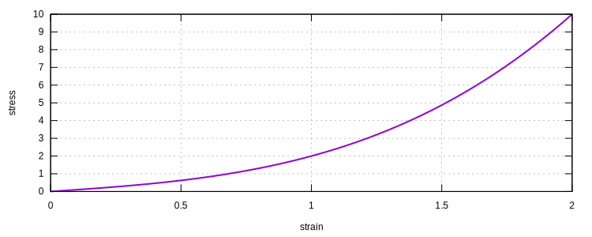

# expression

The `expression` command can be used to define mathematical expressions that can be later used to customise relevant
material models.

The `expression` command essentially parses a block of plain text into mathematical expressions.
The parsing and evaluation functionalities are powered by [`exprtk`](https://github.com/ArashPartow/exprtk).

The `exprtk` generates an AST from the input text. The evaluation of the expression has an on par performance with
the native C++ code.

But a customisable expression allows for more flexibility and it is easier to experiment different functions.

## Syntax

### Simple Scalar-valued Expression

```text
expression SimpleScalar (1) (2) (3)
# (1) int, unique expression tag
# (2) string, input variable list
# (3) string, expression string or name of file containing expression
```

This evaluates a scalar-valued function $$f(x_1,x_2,\cdots,x_n)$$.
The input arguments can be either scalars or vectors.
For example, `"x_1|2|x_2"` represents two variables: 1) $$x_1$$ is a vector of size 2 and 2) $$x_2$$ is a scalar.
The function value is returned as a result.
The expression should be in the form of, for example, $$x_1^2+x_2^2$$.

This form ***supports*** automatic computation of derivatives.
Thus, it can be used in models that require automatic computation of derivatives.

### Simple Vector-valued Expression

```text
expression SimpleVector (1) (2) (3) (4)
# (1) int, unique expression tag
# (2) string, input variable list
# (3) string, output variable list
# (4) string, expression string or name of file containing expression
```

This evaluates a vector-valued function $$y:=f(x_1,x_2,\cdots,x_n)$$.
An assignment must be used to explicitly assign values to the output variables.
The input arguments can be either scalars or vectors.
The output argument should be a vector, the size shall be given such that $$y|3$$ represents a vector of size 3.

This form ***does not support*** automatic computation of derivatives.
Thus, it ***cannot*** be used in models that require automatic computation of derivatives.

## Remarks

1.  The variables in the expression need to be explicitly given as the arguments.
    It can be either unquoted or quoted by `"`.
2.  Multiple variables must be separated by vertical bar `|`.
3.  The expression can be given as a string or as a file name. The program tries to load the file first. If the file
    does not exist, the program tries to parse the string as an expression.
4.  No whitespace (including `,`, ` `, etc.) is allowed in any arguments.

`exprtk` provides very powerful functionalities. It is possible to apply logics and control flows in the expression.

## Example

Say, for example, one is going to define a uniaxial nonlinear elastic model that uses the following stress-strain
relationship:

$$
\sigma=\varepsilon^3+\varepsilon
$$

Then the expression can be defined as

```text
expression SimpleScalar 1 x x^3+x
```

Here, we use `x` as the free variable and the corresponding expression is `x^3+x`.

For the unixial nonlienar elastic model, the input is strain, which maps to `x`, the output maps to stress.

Alternatively, the expression can be stored in a file and loaded by the program.

```text title="cubic.txt"
x^3+x
```

Then the expression can be defined as

```text
expression SimpleScalar 1 x cubic.txt
```

For complex expressions, it is convenient to use the file format.

To use the expression, here, [`CustomElastic1D`](../../Library/Material/Material1D/Elastic/CustomElastic1D.md) is used.

```text
# using expression 1
material CustomElastic1D 1 1

materialTest1D 1 1E-2 200

exit
```

The response can be tested by [material tester](../Process/materialtest.md).

## Result


