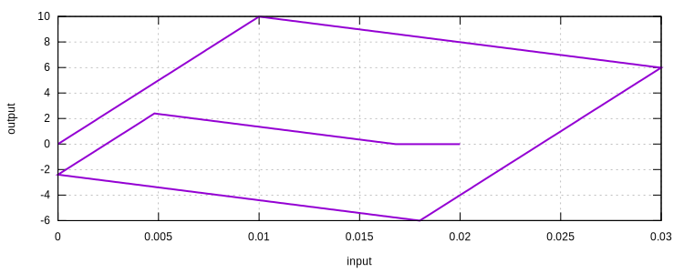

# materialtest

This command category can be used to test most material models **depend on strain input only** without establishing a FE
model. Some wrappers and material models that rely on other material models cannot be tested in this way.

## Syntax

```
materialTest1D (1) (2) (3) [4...]
# (1) int, unique tag of the material model to use
# (2) double, size of per strain increment
# (3) int, number of steps along increment direction
# [4...] int, optional numbers of steps for strain history

materialTest2D (1) (2...4) (5) [6...]
# (1) int, unique tag of the material model to use
# (2...4) double, size of per strain increment
# (5) int, number of steps along increment direction
# [6...] int, optional numbers of steps for strain history

materialTest3D (1) (2...7) (8) [9...]
# (1) int, unique tag of the material model to use
# (2...7) double, size of per strain increment
# (8) int, number of steps along increment direction
# [9...] int, optional numbers of steps for strain history
```

## Remarks

1. The increment size could be either positive or negative.
2. The loading direction reverses after given numbers of steps.
3. The strain-stress history would be saved to `RESULT.txt`. If `HDF5` is used, the result would be additionally saved
   to `RESULT.h5`. Besides, a `gnuplot` file named `RESULT.plt` will be generated.

## Usage

To use the tester, it is necessary to define a material beforehand. Here a `Bilinear1D` model is defined with elastic
modulus $$E=1000.0$$, yield stress $$\sigma_y=10.0$$ and a negative hardening ratio $$h=-0.2$$.

```
material Bilinear1D 1 1000.0 10.0 -0.2
```

The following command loads towards positive strain direction for 300 increments with increment size of $$0.0001$$ then
negative direction for another 300 increments and eventually 200 increments towards positive direction. The ending
strain would be $$\varepsilon=0.02$$.

```
materialTest1D 1 0.0001 300 300 200
```

The output is shown as follows.


