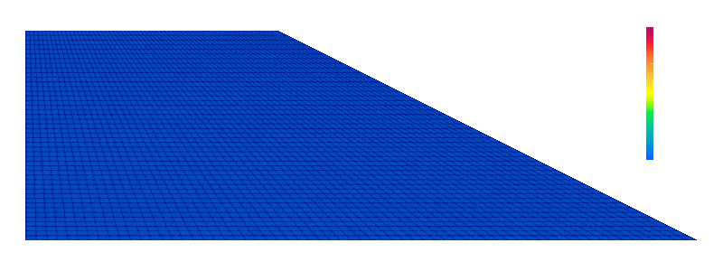

# [★☆☆☆☆] Slope Stability Analysis

In this example, we demonstrate the use of the [`DruckerPrager`](../../Library/Material/Material3D/DruckerPrager/NonlinearDruckerPrager.md) model by performing a slope stability analysis on a homogeneous soil slope with no foundation layer.
This example is taken from [the paper](https://www.icevirtuallibrary.com/doi/abs/10.1680/geot.1999.49.3.387).
Slope stability analysis is one of the most fundamental type of analyses in geotechnical engineering.
While limit equilibrium method is most commonly used for this, finite element method is an important alternative as it does not make any assumptions about the failure surface.
For more information about this, refer to the above the paper.

The model scripts can be [downloaded](slope-analysis.zip).

## The Model

The geometry is defined as a slope of vertical height of $$h=10~\mathrm{m}$$ and the slope angle is $$26.57$$ degrees.
The factor of safety of the slope is taken to be $$1.432$$ and unit weight of soils is taken as $$w=20~\mathrm{kN/m^3}$$.
The (initial) cohesion of the soil is computed using the formula

$$
c_0=\dfrac{0.05wh}{\text{FoS}}=\dfrac{0.05\times20~\mathrm{kN/m^3}\times10~\mathrm{m}}{1.432}=6.983~\mathrm{kPa}
$$

and the effective internal angle of friction was computed as

$$
\phi=\arctan\dfrac{\tan\phi'}{\text{FoS}},
$$

where $$\phi'=20^\circ$$ is the internal angle of friction.  

The mesh is defined in the files `nodes.supan` and `elements.supan` presented in the zip file.

The elements are defined to be of [`CP4`](../../Library/Element/Membrane/Plane/CP4.md) type.

Since it is a plain strain problem, the material model shall be wrapped into a [`PlainStrain`](../../Library//Material/Wrapper/PlaneStrain.md) one.
Unlike other platforms such as `ABAQUS`, in which there are `CPS4` and `CPE4` elements, whether it is plane stress or plane strain is **not** controlled by the element in `suanPan`.
That is why one can only find one unified element type [`CP4`](../../Library/Element/Membrane/Plane/CP4.md).
Here, we use the bilinear hardening [`DruckerPrager`](../../Library/Material/Material3D/DruckerPrager/BilinearDP.md) model with a small hardening ratio.

```text
material BilinearDP 1 1E5 0.3 0.31 0.31 1.219 6.983 0.001
material PlaneStrain 2 1
```

For more information on how to compute the parameters, please check [this](../../Library/Material/Material3D/DruckerPrager/NonlinearDruckerPrager.md) page.
In this problem, the Drucker-Prager yield surface circumscribes the Mohr-Coulomb yield surface. 

## BCs and Loading

The horizontal displacement of left and bottom boundaries is constrained.
The vertical displacement of the bottom boundary is constrained.
To apply those constraints, we select two boundaries by generating two node groups.

```text
# left vertical boundary
generatebyrule nodegroup 2 1 1. 0.
# bottom horizontal boundary
generatebyrule nodegroup 3 2 1. 0.

grouppenaltybc 1 1 2 3
grouppenaltybc 2 2 3
```

The loading applied was of gravity type, where the load factor is increased from `0` to `1`.
We use [`bodyforce`](../../Collection/Define/load.md#body-force) to apply this load.

```text
# all elements
generate elementgroup 1 1 2880
load groupbodyforce 1 0 -20 2 1
```

In this case, the force applied is equal to the specific weight of the soil applied in the negative y-direction.
We also generate an element group that contains all elements.

## Result

The following shows the development of horizontal displacement.


