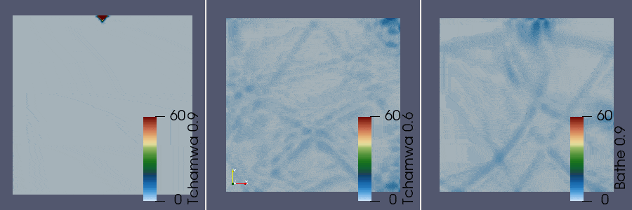

# [★★★☆☆] Propagation of A Planar Wave

In this example, we demonstrate an example of wave propagation in a 2D solid.

Essentially, it is a 2D dynamics problem. The [CP4](../../Library/Element/Membrane/Plane/CP4.md) element is used to
model the solid.
Various time integration methods will be used to compare their performance regarding numerical energy dispersion.

The model script can be downloaded [here](wave-propagation.zip).

**This model contains 16641 nodes and 16384 elements. The memory usage is about 1.2 GB.**

**Due to small step size and need to export visualization data, the full analysis takes around 20 minutes to complete on
an average PC platform (6 physical cores @ 3 GHz).**

## Model

A square solid of size $$3200\times3200$$ is used. The structured mesh can be generated by using whatever mesh generator
available. It is not difficult to generate an array of squares using scripting languages such as Python or Matlab.
Here, [Gmsh](https://gmsh.info/) is used.

The left boundary is constrained along the horizontal direction. The bottom boundary is constrained along the vertical
direction. The top and right boundaries are free. An initial velocity is assigned to the node at the centre of the top
boundary.

### Material

Whether plane stress or plane strain assumption is adopted is not the focus of this example, we simply use a plane
stress element with a unit thickness.

```text
material Elastic2D 1 1E7 .2 1 1
```

### Visualisation

For visualisation, we define a [`Visualisation`](../../Library/Recorder/Recorder.md) recorder.
We record von Mises stress to represent the propagation of stress field.

```text
hdf5recorder 1 Visualisation MISES width 5
```

### IBC

The boundaries can be extracted by [generating](../../Collection/Define/generate.md) node groups.

```text
generatebyrule nodegroup 1 1 1. 0. # left
generatebyrule nodegroup 2 2 1. 0. # bottom
```

Then BCs can be applied via [`groupmultiplierbc`](../../Collection/Define/bc.md).

```text
groupmultiplierbc 1 1 1 2
```

The initial condition can be applied using [`initial`](../../Collection/Define/initial.md) command.

```text
# node 322 is the centre of the top boundary (1600,3200)
initial velocity -1 2 322
```

### Time Integration

We use both implicit and explicit time integration methods.

#### Implicit

The implicit time integration methods are the default.
If no integrator is defined, a default [Newmark](../../Library/Integrator/Newmark/Newmark.md) integrator will be used.

An implicit integrator shall be used with an implicit step.

```text
step ImplicitDynamic 1 4
# or just
# step Dynamic 1 4
```

#### Explicit

Most explicit methods use acceleration as the primary variable, the equations of motion are often expressed as a
function of acceleration.
This differs from implicit methods that often use displacement as the primary variable.
In order to adopt such a difference, one needs to define an `ExplicitDynamic` step, similar to the setting in ABAQUS.

```text
step ExplicitDynamic 1 4
```

Please be aware that most displacement-based constraints **cannot** be used in explicit analysis.

#### Other Settings

Since we are using a linear elastic material with the CP4 elements.
The elemental stiffness is symmetric.
As there are no other non-linear constraints defined in the model, the global stiffness/mass matrix is also symmetric.
It is possible to then turn on symmetric banded storage to save memory space.

Also, since the system is linear, the global stiffness/mass matrix does not change once assembled.
It is possible to indicate the solver to skip iterations.

```text
set symm_mat 1
set band_mat 1
set linear_system 1
```

## Results

For a not-so-rigorous comparison, different spectral radii are used for different methods, mainly for the purpose of
showcasing different methods.

Also, the chosen model parameters are quite arbitrary.
Sufficently accurate results often require an accurate estimation of the highest frequency of the model, which governs the time step size.

### Implicit

The [Bathe](../../Library/Integrator/BatheTwoStep.md) two-step method appears to have the best numerical dispersion
performance among implicit methods.

The [GSSSS](../../Library/Integrator/GSSSS.md) optimal scheme is also fine if the spectral radius is chosen properly.

The second-order, unconditionally stable [Newmark](../../Library/Integrator/Newmark/Newmark.md) method has significant
high-frequency noise.
This explains why it is mainly used for structural dynamics in which the low-frequency response is of interest.

The chosen time step size is 0.01 s for all three cases. The following radii are used:

- Bathe Implicit: 0.9
- GSSSS Optimal: 0.8
- Newmark: 1.0


### Explicit

The explicit methods show better numerical dispersion.

The [Tchamwa](../../Library/Integrator/Tchamwa.md) method is first-order accurate, and does not require corrector.

The [Noh-Bathe](../../Library/Integrator/BatheExplicit.md) two-step explicit method, as discussed in the original
reference, shows superior performance.
However, it requires a corrector step, which requires an additional element-wise computation for each substep.
This increases the computational cost.

The chosen time step size is 0.001 s. The following radii are used:

- Tchamwa: 0.9
- Tchamwa: 0.6
- Bathe Explicit: 0.9


