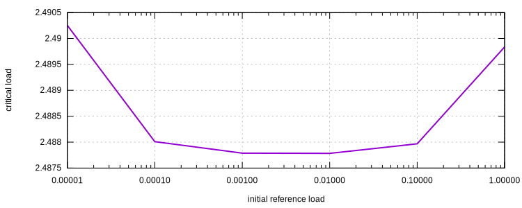

# Buckling Analysis of A Cantilever Beam

We present a buckling analysis of a cantilever beam with validations.

Consider a cantilever beam with a length of $$L=10$$ and a unit square cross-section, viz., $$b=h=1$$. The elastic
modulus of the material used is assumed to be $$E=1200$$. So that the bending stiffness $$EI$$ is

$$
EI=E\dfrac{bh^3}{12}=1200\times\dfrac{1}{12}=100.
$$

According to the Euler's formula, the critical axial load of such a cantilever beam is given as

$$
P_{cr}=\dfrac{\pi^2EI}{(KL)^2}
$$

with $$K=2$$ for cantilever beams.

Substituting model properties into the formula, one could obtain

$$
P_{cr}=\dfrac{\pi^2EI}{(KL)^2}=\dfrac{\pi^2\times100}{4\times10^2}\approx2.4674.
$$

## Model Geometry

We use the `B21` element to model the problem. Since `B21` incorporates with sections, we need to define a proper
section, the `Rectangle2D` is used. The geometry is stored in file `geometry.supan`.

```
! file name: geometry.supan
! material and section
material Elastic1D 1 1200
section Rectangle2D 1 1 1 1
! nodes
node 1 0 0
node 2 2 0
node 3 4 0
node 4 6 0
node 5 8 0
node 6 10 0
! elements with 6 integration points along element chord
element B21 1 1 2 1 6 1
element B21 2 2 3 1 6 1
element B21 3 3 4 1 6 1
element B21 4 4 5 1 6 1
element B21 5 5 6 1 6 1
```

Note for a buckling analysis, the nonlinear geometry has been turned on, here `B21` uses a corotational formulation.

## Buckling Analysis

The analysis commands are stored in file `analysis.supan`. First we fix the first node and apply a reference axial
compression. Theoretically, this applied axial compression force could have **arbitrary** magnitude in the context of **
linear** buckling analysis. However, in `suanPan`, the nonlinear (instead of linear) analysis would be performed first.
So the result depends on the magnitude of applied force.

```
! analysis.supan
! load model geometry first
file geometry.supan
! apply bc
fix 1 P 1
! apply axial load on the free end
cload 1 0 -1E-2 1 6
```

We could then create a `buckle` step and analysis the problem. Alternatively, the keyword `buckling` could be used. It
shall be noted, the stiffness in nonlinear analysis may not be positive definite, thus not all matrix storage schemes
are valid to solve the problem. It is recommended to use asymmetric schemes.

```
! analysis.supan
step buckle 1
set symm_mat false
analyze
exit
```

The output is

```
+--------------------------------------------------+
|   __        __        suanPan is an open source  |
|  /  \      |  \          FEM framework (64-bit)  |
|  \__       |__/  __   __          Acrux (0.1.0)  |
|     \ |  | |    /  | |  |                        |
|  \__/ |__| |    |__X |  |     maintained by tlc  |
|                             all rights reserved  |
+--------------------------------------------------+

current analysis time: 1.00000.

buckling load multiplier: 2.48778147E+02.

Finished in 0.005 seconds.
```

The buckling load is then the multiplication of initial reference load and multiplier.

$$
P_{cr}=2.488\times10^2\times1\times10^{-2}=2.488.
$$

This is close to the Euler's solution. Mesh refinement could be applied to obtain closer value. The effect of different
magnitudes of initial reference load is shown as below.



A full nonlinear bifurcation analysis is available in another page.
