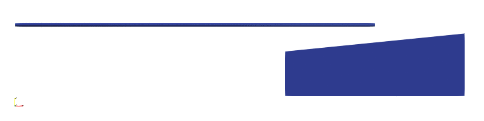

# Contact Between Beam And Block

In this example, we showcase the simulation of a 2D node-line contact problem. The model can be
downloaded. [contact-between-beam-and-block.zip](contact-between-beam-and-block.zip)

## The Beam

Suppose there is an elastic cantilever beam with left end at $$(0,0)$$ fully fixed, and right end at $$(2,0)$$. The
middle point is subjected to a displacement load.

First, we define some nodes.

```
node 1 0 0
node 2 .5 0
node 3 1 0
node 4 1.5 0
node 5 2 0
```

We use `EB21` element to define the element. Accordingly, an elastic material is attached.

```
# E=10
material Elastic1D 1 10

# I=12 A=1
element EB21 1 1 2 12 1 1
element EB21 2 2 3 12 1 1
element EB21 3 3 4 12 1 1
element EB21 4 4 5 12 1 1

fix 1 P 1

displacement 1 0 -.1 2 3
```

## The Block

We use `CP4` to define the block.

```
node 6 1.5 -.4
node 7 2.5 -.4
node 8 2.5 -.05
node 9 1.5 -.15

# E=10 v=0.2
material Elastic2D 2 10 .2

# use material 2
element CP4 5 6 7 8 9 2 1.

fix 2 P 6 7
```

## The Contact Interaction

### Penalty Function Method

The [`Contact2D`](../../../Library/Element/Special/Contact2D.md) element is used to define contact. It requires two node
groups that define master and slave, respectively.

Note the outer normal vector of master line is defined by rotating the axis by $$\pi/2$$ anticlockwise, the node
sequence matters.

```
# slave node group
nodegroup 1 5

# master node group, pay attention to the sequence
nodegroup 2 9 8

# define the contact
# multiplier=1E6
element Contact2D 6 2 1 1E6
```

### Lagrangian Multiplier Method

The [`NodeLine`](../../../Library/Constraint/NodeLine.md) contact constraint can be applied in order to properly account
for contact interaction. Each constraint requires three nodes: master $$i$$, master $$j$$ and slave $$k$$. Again the
outer normal vector of master line is defined by rotating the axis by $$\pi/2$$ anticlockwise, the node sequence
matters.

```
constraint NodeLine 3 9 8 5
```

## Other Settings and Analysis

It would be good to define a `Visualisation` recorder so that animations can be generated later by ParaView.

```
hdf5recorder 1 Visualisation U2
```

Now define the step and perform the analysis.

```
step static 1
set ini_step_size 1E-2
set fixed_step_size 1

converger RelIncreDisp 2 1E-10 10 1

analyze

exit
```

## Result



## Remarks

The contact itself is implemented as an element thus the contact force cannot be directly spotted in the resistance of
corresponding nodes.

The master lines and slave nodes do not rely on the specific elements connected. Thus, the node-line contact can be
applied to any 2D problems with various element types including truss, beam, membrane, etc.

To define a single contact element is not a difficult task but for large scale problems, it may be quite cumbersome as
all potential contact pairs need to be defined. For better performance, it is recommended to have few master lines in
each element while a couple of contact elements can be defined so that contact detection can be run in parallel.