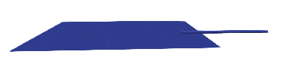

# [★★★★☆] Contact In 3D Space

The simplest case in 3D space would be node to triangular facet contact.

In this example, we show how to model 3D contact problems by using both penalty function method and Lagrangian
multiplier method.

The model scripts can be [downloaded](contact-in-3d-space.supan).

## The Model

The contact itself does not need to be defined on any discrete surfaces of elements. Instead, the facet is always
formulated by the given three nodes. Thus, contacts can be defined on, for examples, plate/shell surfaces,
cube/tetrahedron surfaces, or even three nodes only.

Here we define a square flat shell with one edge clamped.

```
node 1 0 0 0
node 2 5 0 0
node 3 10 0 0
node 4 0 5 0
node 5 5 5 0
node 6 10 5 0

element dkts3 1 1 2 5 1 1
element dkts3 2 5 4 1 1 1
element dkts3 3 2 3 6 1 1
element dkts3 4 6 5 2 1 1

material Elastic2D 1 1000 .2

generate nodegroup 1 1 3 4

groupmultiplierbc 1 encastre 1
```

A 3D beam cantilever beam is defined on top of the shell.

```
node 10 8.5 2 .1
node 11 11.5 2 .1
node 12 14.5 2 .1

orientation B3DL 1 0. 0. 1.

material Elastic1D 2 10

section Rectangle3D 1 12 1 2

element B31 10 10 11 1 1
element B31 11 11 12 1 1

fix2 2 encastre 12
```

Once the deformed free end reaches the shell, contact occurs.

## Define Contact

The facet is defined by nodes `3`, `6` and `10`. The slave node is `2`.

```
constraint NodeFacet 3 2 3 6 10
```

## Results

After configuring analysis, it can be performed.

```
hdf5recorder 1 Visualisation U3

step static 1 1.000e+00
set ini_step_size 1.000e-1
set fixed_step_size true

converger RelIncreDisp 1 1E-10 20 1

cload 1 0 -50. 3 11

analyze

exit
```

The animation can be shown as follows.

