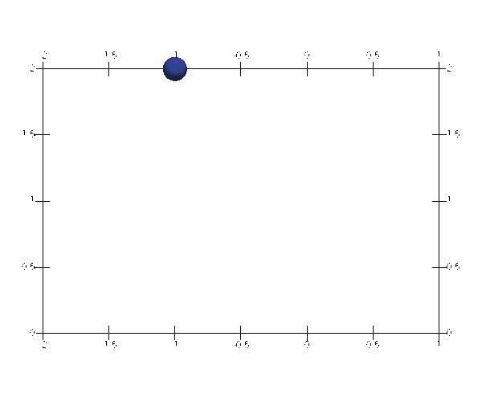
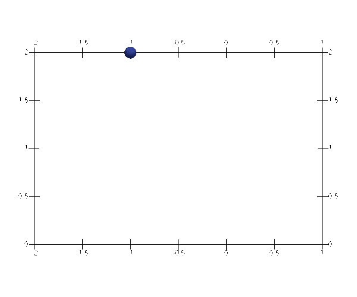

# [★★★☆☆] Bouncing of a Ball

In this example we show the application of the [`RigidWall`](../../../Library/Constraint/RigidWall.md) and 
[`RestitutionWall`](../../../Library/Constraint/RestitutionWall.md) constraints. It is also possible to define a 
rigid wall with finite dimension. The model script can be [downloaded](bouncing-of-a-ball.supan).

A mass point is used to idealize the ball. As this is a dynamics problem of rigid body, there is no need to define any
material models to provide stiffness matrix. For this reason, it is possible to just define a point mass at the target
point.

```
# define a node at (-1,2)
node 1 -1 2
# define a unit point mass element at node 1, both DoF 1 and DoF 2 are activated
mass 1 1 1 1 2
```

No matter how the gravity load is applied, it is required to define a constant amplitude that provides a constant level
of either gravity force or acceleration. We define a proper amplitude first.

```
amplitude Constant 1
```

To apply the gravity, we use a constant vertical acceleration load, to do so,

```
# define a acceleration load of magnitude -1 using amplitude 1 on DoF 2 of node 1
acceleration 1 1 -1 2 1
```

Alternatively, a vertical load can be applied

```
cload 1 1 -1 2 1
```

Since the initial state is always in equilibrium, an initial condition can be added.

```
# assign initial acceleration of maginutde of -1 on DoF 2 of node 1
initial acc -1 2 1
```

## Free Fall

Now the model is ready to run a free fall simulation.

```
step dynamic 1 1
set ini_step_size 1E-1
set fixed_step_size 1
converger RelIncreDisp 1 1E-8 10 1
analyze
peek node 1
exit
```

A default Newmark time integration algorithm will be assigned if no valid integrator is defined. The output is

```
Node 1:
  -1.0000   2.0000
Displacement:
        0  -0.5000
Resistance:
        0        0
Velocity:
        0  -1.0000
Acceleration:
        0  -1.0000
```

The analytical displacement can be simply computed as

$$
u=\dfrac{1}{2}at^2=\dfrac{1}{2}.
$$

## Rigid Wall Constraint

We define two infinite rigid wall constraints inclined $$\pi/4$$ and $$3\pi/4$$ to form a right angle. The ball can
bounce between two walls. Two walls are both anchored at the origin and have infinite dimension, the outer normals are
$$(1,1)$$ and $$(-1,1)$$, respectively. The penalty factor is chosen to be $$0.1$$ in this particular example. 
Accounting for the time step defined below ($$0.005$$), the actual penalty factor applied to the effective stiffness is
$$0.1/0005/0.005=4000$$.

```
rigidwall 1 0 0 1 1 1E-1
rigidwall 2 0 0 -1 1 1E-1
```

The penalty factor can be altered to achieve different levels of satisfactions of the constraint. But higher values also
result in greater high frequency noise.

It may be of interest to record the motion of the ball.

```
hdf5recorder 1 Node U 1
hdf5recorder 2 Node V 1
hdf5recorder 3 Node A 1
```

Then configure the analysis,

```
step dynamic 1 40
set ini_step_size 5E-3
set fixed_step_size 1

converger RelIncreDisp 1 1E-8 7 1

analyze
```

The results are shown as follows.


The energy of the system is **not** conserved. To alleviate this problem, one can use the 
[`RestitutionWall`](../../../Library/Constraint/RestitutionWall.md) constraint.

## Restitution Wall Constraint

### Elastic Collision

The constraints can be replaced by

```
restitutionwall 1 0 0 1 1 1. 1E4
restitutionwall 2 0 0 -1 1 1. 1E4
```

Here the coefficient of restitution is set to 1.



### Plastic Collision

One can define a plastic collision by using a coefficient of restitution smaller than unity.

```
restitutionwall 1 0 0 1 1 .9 1E4
restitutionwall 2 0 0 -1 1 .9 1E4
```


