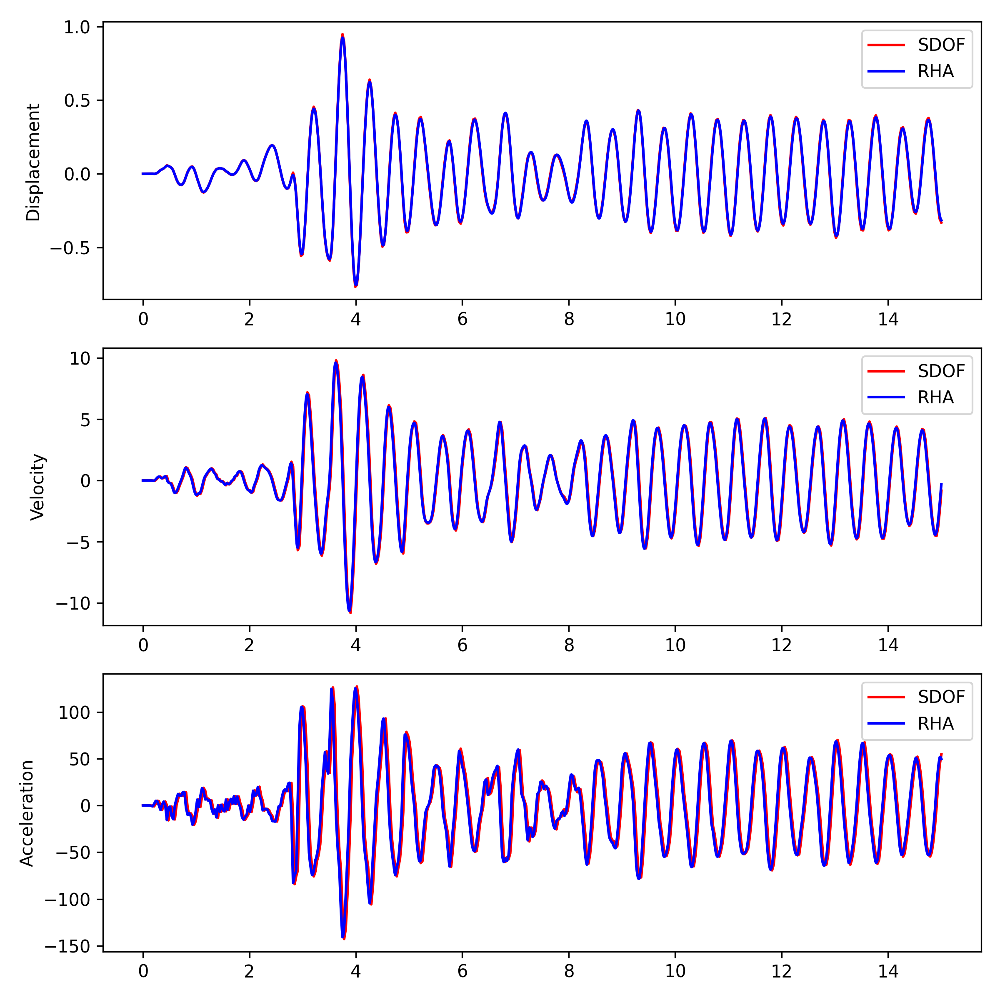
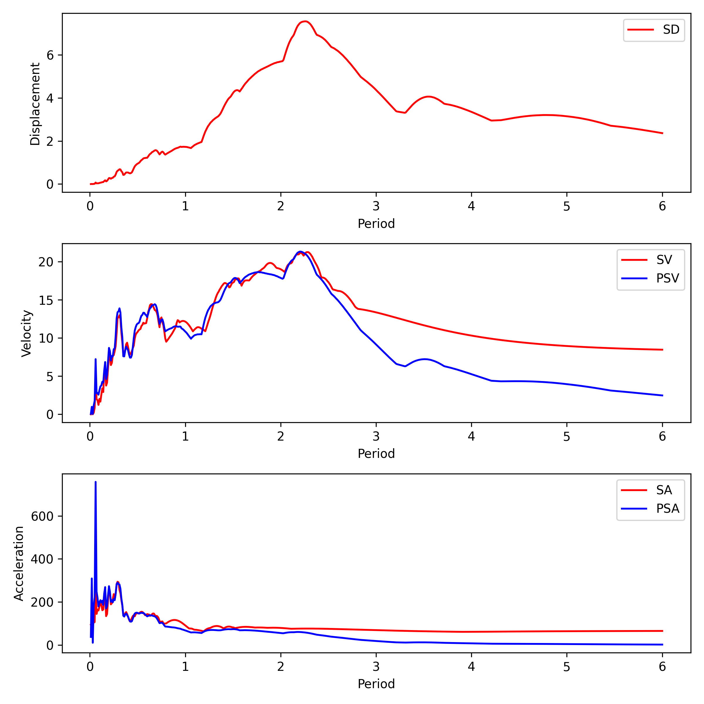
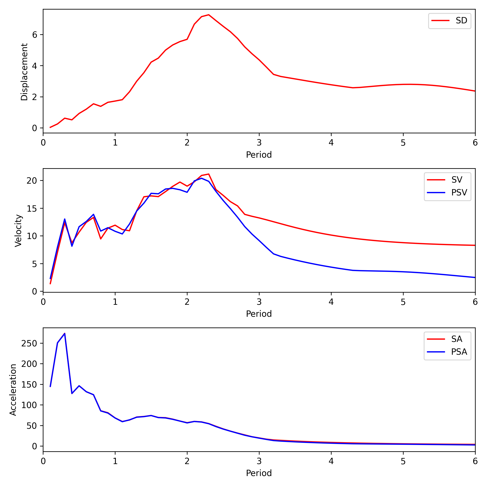

# [★☆☆☆☆] Response Spectrum

Minimum version: v2.6

The model script can be downloaded. [computing-response-spectrum.zip](computing-response-spectrum.zip)

## Introduction

Imaging you are asked to compute the response spectra of a collection of accelerograms which may be obtained from
some earthquake event. How would you do it?

According to the definition, the response spectrum is the maximum response of structures with different natural
frequencies to the same earthquake.

A natural approach is to:

1. Create a SDOF linear mass-spring-dashpot model with proper parameters that result in the desired natural
   frequencies and damping ratios.
2. Perform full response history analysis for each frequency point.
3. Compute the maximum response at each frequency point.
4. Plot the response spectrum.

This is fine, but extremely inefficient. For linear systems, you may have known
that [Duhamel's integral](https://en.wikipedia.org/wiki/Duhamel%27s_integral)
can be used to compute the response. Indeed, Duhamel's integral is a de facto practice for computing response
spectra, especially in the field of seismology.

However, even Duhamel's integral is not sufficiently performant. A blazing fast algorithm is proposed
by [Lee](https://doi.org/10.1016/S0267-7261(05)80015-6).
The algorithm is implemented as the [`response_spectrum`](../../../Collection/Process/response_spectrum.md) and
the [`sdof_response`](../../../Collection/Process/sdof_response.md) command.

In this example, we will demonstrate how to use the `response_spectrum` and `sdof_response` commands to compute the
response spectra and compare the results with the full response history analysis.

## Model

To allow comparison, we define a minimum SDOF model.

```text
# rha.sp

node 1 0 0
node 2 1 0

material Elastic1D 1 1.57913670417430E2

element T2D2 1 1 2 1 1

mass 2 2 1 1

fix2 1 1 1
fix2 2 2 1 2

modifier Rayleigh 1 0 0.003183098862 0. 0. 1

amplitude Tabular 1 EZ

cload 1 1 -1 1 2

plainrecorder 1 Node U 2
plainrecorder 2 Node V 2
plainrecorder 3 Node A 2

step dynamic 1 15
set ini_step_size 1E-2
set fixed_step_size 1

integrator Newmark 1

converger AbsIncreDisp 1 1E-13 10 1

analyze

save recorder 1 2 3

exit
```

We assume the frequency of the SDOF model is $$2$$ Hz, which is equivalent to a natural frequency of $$4\pi$$ rad/s.
The damping ratio is chosen to be a typical value $$0.02$$.

Assuming a unit mass and a stiffness proportional damping model, this gives the following parameters.

$$
m=1,\quad{}\omega_n=4\pi,\quad{}k=\omega_n^2m=16\pi^2.
$$

For damping, assuming $$c=a_1k$$, then

$$
c=2\zeta\sqrt{mk}=a_1k,\quad{}a_1=2\zeta/\omega_n=0.003183098862.
$$

The provided acceleration is sampled with a sampling interval of $$0.03$$ s. To improve the accuracy of the response
history analysis, the time step size is set to $$0.01$$ s.

Note since we are applying acceleration as inertial force, the amplitude of the acceleration is $$-1$$.

## SDOF Response

The `sdof_response` command can be used to compute the response.

```text
# sdof.sp

sdof_response EZ 2 0.02

exit
```

The result will be saved to `EZ_sdof_response`.

## Analyse and Compare

We can now run `rha.sp` and `sdof.sp` to obtain two sets of results.

```python
import os
from shutil import which

if os.name == 'nt':
    exe_name = 'suanPan.exe'
else:
    exe_name = 'suanpan'

if which(exe_name):
    os.system(f'{exe_name} -np -f rha.sp')
    os.system(f'{exe_name} -np -f sdof.sp')
```

Now let's try to plot the results.

```python
import matplotlib.pyplot as plt
import numpy as np

with open('EZ_sdof_response', 'r') as f:
    sdof = np.loadtxt(f)
with open('R1-U2.txt', 'r') as f:
    displacement = np.loadtxt(f)
with open('R2-V2.txt', 'r') as f:
    velocity = np.loadtxt(f)
with open('R3-A2.txt', 'r') as f:
    acceleration = np.loadtxt(f)

fig = plt.figure(figsize=(8, 8), dpi=300)
ax1 = fig.add_subplot(311)
for index, record, label in zip(
        [1, 2, 3], [displacement, velocity, acceleration], ['Displacement', 'Velocity', 'Acceleration']):
    ax = fig.add_subplot(310 + index)
    ax.plot(sdof[:, 0], sdof[:, index], 'r-', label='SDOF')
    ax.plot(record[:, 0], record[:, 1], 'b-', label='RHA')
    ax.set_ylabel(label)
    ax.legend()
fig.tight_layout()
fig.savefig('time_response.png')
plt.close()
```

The results are shown below.



It is evident that Lee's algorithm is accurate. If one pays attention to the wall clock time required by two approaches,
Lee's algorithm is much faster than the full response history analysis. On an average platform, Lee's algorithm is 
100 times faster (indicative). There are a few things to note.

1. The response history analysis often requires a small step size --- a fraction of sampling interval of 
   acceleration record. This is to ensure the accuracy of the result.
2. Lee's algorithm is essentially an IIR filter. It only requires two multiplications per time step. The sampling 
   interval can be directly used to compute the response.
3. With Lee's algorithm, in a more general setting, velocity and acceleration responses would be computed as the 
   scaled difference of displacement and velocity responses, respectively. They are also blazing fast to compute.
4. To compute response spectrum, as we only need the maximum response, further optimisation can be made. See Lee's 
   paper for further discussions.

## Response Spectrum

### Initial Attempt

We have gained some confidence in the reliability of the result. The `response_spectrum` command essentially calls the
`sdof_response` command to compute the maximum response at each frequency. Now we can use it to compute response 
spectrum.

```text

```text
# spectrum.sp

response_spectrum EZ period 0.02

exit
```

We provide a vector of periods of interest. The result will be saved to `EZ_response_spectrum`. The spectra can be 
plotted.

```python
import matplotlib.pyplot as plt
import numpy as np

with open('EZ_response_spectrum', 'r') as f:
    spectrum = np.loadtxt(f)

fig = plt.figure(figsize=(8, 8), dpi=300)
ax1 = fig.add_subplot(311)
ax1.plot(spectrum[:, 0], spectrum[:, 1], 'r-', label='SD')
ax1.set_ylabel('Displacement')
ax1.set_xlabel('Period')
ax1.legend()
ax2 = fig.add_subplot(312)
ax2.plot(spectrum[:, 0], spectrum[:, 2], 'r-', label='SV')
ax2.plot(spectrum[:, 0], 2 * np.pi * spectrum[:, 1] / spectrum[:, 0], 'b-', label='PSV')
ax2.set_ylabel('Velocity')
ax2.set_xlabel('Period')
ax2.legend()
ax3 = fig.add_subplot(313)
ax3.plot(spectrum[:, 0], spectrum[:, 3], 'r-', label='SA')
ax3.plot(spectrum[:, 0], 2 * np.pi * 2 * np.pi * spectrum[:, 1] / spectrum[:, 0] / spectrum[:, 0], 'b-', label='PSA')
ax3.set_ylabel('Acceleration')
ax3.set_xlabel('Period')
ax3.legend()
fig.tight_layout()
fig.savefig('response_spectrum.png')
plt.close()
```



### Refine the Result

As the sampling interval of the provided acceleration record is $$0.03$$ s, it appears to be too large to obtain 
accurate result. How to tell that? Given that the damping ratio is small, SA and PSA should be close.

We can try to refine the result by using a smaller interval. To this end, we first create a new record by linear 
interpolation.

```python
import numpy as np

EZ = np.loadtxt('EZ')

time = np.arange(0, 10, 0.001)
amplitude = np.interp(time, EZ[:, 0], EZ[:, 1])

np.savetxt('EZ_refined', np.column_stack((time, amplitude)))
```

Now we can run the analysis again.

```text
# spectrum_refined.sp

response_spectrum EZ_refined freq 0.02

exit
```

The results are shown as follows.


