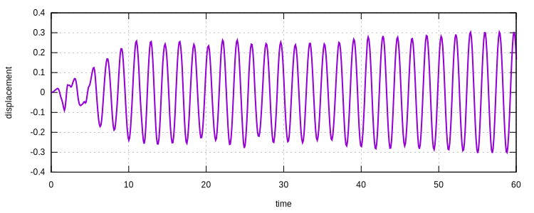
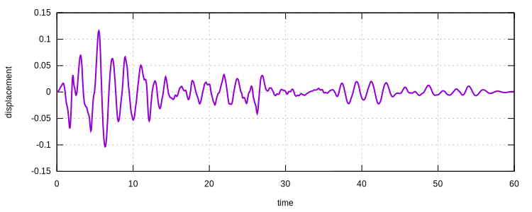

# [★★☆☆☆] Dynamic Analysis of a Portal Frame

A portal frame is analysed using viscous damper as energy dissipater.

The model script can be downloaded. [dynamic-analysis-of-a-portal-frame.zip](dynamic-analysis-of-a-portal-frame.zip)

## Model Description

Consider a simple portal frame with the following configurations.


Then

$$
EI_c=2\times10^5\times3.18\times10^6=6.36\times10^{11}~\mathrm{Nmm^2}=0.636~\mathrm{MNm^2}.
$$

Since the moment of inertia of the beam is about ten times larger than that of column, it is fair to assume the beam is rigid.
So the horizontal translation stiffness is

$$
K=2K_c=2\times\dfrac{12EI}{L^3}=2\times\dfrac{12\times0.636~\mathrm{MNm^2}}{5^3~\mathrm{m^3}}=122.112~\mathrm{kN/m}.
$$

Hence, the period is

$$
t=\dfrac{2\pi}{\omega}=2\pi\sqrt{\dfrac{M}{K}}=2\pi\sqrt{\dfrac{10~\mathrm{t}}{122.112~\mathrm{kN/m}}}\approx1.800~
\mathrm{s}.
$$

## Simulation Setup

First we define nodes, materials, sections and point masses, we use `B21` as elements.

```
! length = meter
! mass = tonne
! force = kilo Newton
node 1 0 0
node 2 0 5
node 3 5 5
node 4 5 0

material Elastic1D 1 200E6

section NZ2D 250UB25.7 1 1 0.001 6
section NZ2D 100UC14.8 2 1 0.001 6

element B21 1 1 2 2 6
element B21 2 2 3 1 6
element B21 3 3 4 2 6

element Mass 4 2 5 1
element Mass 5 3 5 1

fix 1 P 1 4
```

## Model Analysis

By defining a `frequency` step we can obtain the eigenvalue.

```
step frequency 1 1
analyze
peek eigenvalue
```

The output is

```
+--------------------------------------------------------+
|             ____             suanPan is an open source |
|   ___ _   _|  _ \ __ _ _ __     FEM framework (64-bit) |
|  / __| | | | |_) / _` | '_ \           Canopus (3.8.0) |
|  \__ \ |_| |  __/ (_| | | | |        by tlc @ 236da9bc |
|  |___/\__,_|_|   \__,_|_| |_|      all rights reserved |
|                                 10.5281/zenodo.1285221 |
+--------------------------------------------------------+
|  🧮 https://github.com/TLCFEM/suanPan                  |
|  📚 https://tlcfem.github.io/suanPan-manual/latest     |
+--------------------------------------------------------+
|  🌈 https://bit.ly/vsc-sp                              |
+--------------------------------------------------------+


Eigenvalues:
   11.2068


Time Wasted: 0.0031 Seconds.
```

Hence, the corresponding period is

$$
t=\dfrac{2\pi}{\sqrt{11.2068}}\approx1.877~\mathrm{s}.
$$

There is a difference of about $$5\%$$, which may stem from flexible beam. Meanwhile, the computed moment of inertia may
be different from the values given in section property table.

## Dynamic Analysis

Now we run a time history analysis.
The El Centro (NS component) ground motion is used.

First we define the recorder to record response.

```
hdf5recorder 1 Node U1 2 3
```

Then the step.
We define a dynamic step with a duration of fifty seconds.

```
step dynamic 1 50.
```

Normally we use fixed time step.

```
set fixed_step_size true
set ini_step_size 1E-2
```

The ground motion amplitude is loaded from external file.

```
amplitude Tabular 1 ELNS
```

Now we apply acceleration on horizontal DoFs.

```
acceleration 1 1 9.83 1
```

The Newmark algorithm would be used.
We adopt absolute displacement increment as convergence criterion.

```
integrator Newmark 1
converger AbsIncreDisp 1 1E-5 20 1
```

The model is now ready for analysis.

```
analyze
```

The displacement history is shown as follows.



Since no damping is defined, the system oscillates.
Next we use a damper as energy dissipater.

## Damped Model

A viscous damper can be defined.

```
material Viscosity01 2 1. 1E1
element Damper01 6 1 3 2
```

So the damping coefficient is $$\eta=10~\mathrm{kNms^{-1}}$$.
The damping force is simply $$F=\eta\cdot{}v$$.

Rerun the analysis and the damped displacement history is given as follows.

