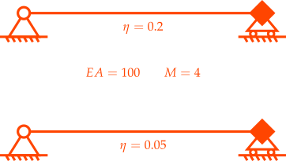
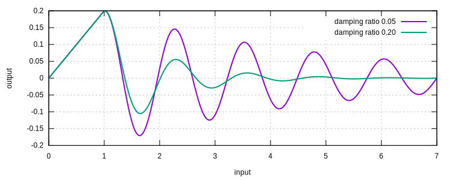

# [★★☆☆☆] Elemental Damping

In this example, we demonstrate how to apply elemental damping to the system.
The model can be [downloaded](elemental-damping.sp).

## Reference

Some damping models are only valid at global level as they may depend on some attributes of the global matrices.
They are inherently not applicable at element level.
Some other damping models, such as the Rayleigh damping model, can be expressed as a linear combination of mass and
stiffness matrices.
The corresponding damping matrix can be either formulated at global level by operating on global stiffness and mass
matrices, or at element level by operating on elemental stiffness and mass matrices.
In the later case, the global damping matrix can be assembled by the elemental damping matrices.

The Lee's damping model [10.1016/j.jsv.2020.115312](https://doi.org/10.1016/j.jsv.2020.115312) is used as the
fundamental model.
It can be expressed in a form that can be expressed as a linear combination of mass and stiffness matrices.

The [10.1016/j.compstruc.2023.107152](https://doi.org/10.1016/j.compstruc.2023.107152) discusses the application of the
damping model at element level and investigates the relationship between the elemental adn global damping ratio.

To use the model, the [`ElementalLee`](../../../Library/Element/Modifier/ElementalLee.md) modifier and
the [`LeeElementalNewmark`](../../../Library/Integrator/Newmark/LeeElementalNewmark.md) integrator shall be used.

## The Model

To make the validation possible and simple, we define two SDOF springs in the same problem domain.
Those two springs are not connected to each other, making them independently respond to the applied load.
This avoids coupling and allows us to validate the damping ratio.
However, the same idea can be applied to complex models such that part of the model is assigned with one damping ratio
while the other parts are assigned with different damping ratios.

```text
node 1 0 0
node 2 1 0
node 3 0 0
node 4 1 0

material Elastic1D 1 100

element T2D2 1 1 2 1 1
element Mass 2 2 4 1

element T2D2 3 3 4 1 1
element Mass 4 4 4 1

fix 1 1 1 3
fix 2 2 1 2 3 4
```



## Elemental Damping

The elemental damping is achieved by two parts.
The global configuration of the damping curve adjusts how the system responds to different frequencies, that is, defines
a reference damping curve.
This part is done via the [`LeeElementalNewmark`](../../../Library/Integrator/Newmark/LeeElementalNewmark.md)
integrator.
The second part assigns damping ratio multipliers to each element via
the [`ElementalLee`](../../../Library/Element/Modifier/ElementalLee.md) modifier.
The actual damping applied to each element is the product of the multiplier and the reference damping curve.

Here, for illustration, we apply $$\eta=0.05$$ and $$\eta=0,2$$ to the two elements, respectively.

```text
modifier ElementalLee 1 .05 1 2
modifier ElementalLee 2 .2 3 4
```

Note the damping is applied to both stiffness and mass.

## Steps

To allow easy validation, we displace the spring and release it for free vibration.

The static step is used to displace the spring.

```text
step static 1 1
set ini_step_size .1
set fixed_step_size 1

displacement 1 0 .2 1 2 4

converger RelIncreDisp 1 1E-10 3 1
```

The dynamic step is used to release the spring.
In this step, the [`LeeElementalNewmark`](../../../Library/Integrator/Newmark/LeeElementalNewmark.md)
integrator is used to define the reference damping curve.
One base function is used, the reference damping ratio is $$1$$ at $$5~\text{rad/s}$$.
The actual damping ratios are $$0.05\times1=0.05$$ and $$0.2\times1=0.2$$, respectively.

```text
step dynamic 2 6
set ini_step_size .02
set fixed_step_size 1
set system_solver GMRES

integrator LeeElementalNewmark 1 .25 .5 1 5

converger RelIncreDisp 2 1E-10 3 1
```

## Results

The logarithmic decrement can be used to determine the damping ratio from the displacement history.

$$
\eta=\dfrac{1}{\sqrt{1+\left(\dfrac{2\pi}{\ln\left(\dfrac{u_0}{u_1}\right)}\right)^2}}.
$$

This is equivalent to

$$
u_1=\dfrac{1}{\exp{\dfrac{2\pi}{\sqrt{\dfrac{1}{\eta^2}-1}}}}u_0.
$$

As $$u_0=0.2$$, for $$\eta=0.05$$, $$u_1=0.146$$, for $$\eta=0.2$$, $$u_1=0.055$$.



Because those two elements are not connected/coupled with each other, they respond independently and follow the assigned
damping ratios.
This is not practically useful but demonstrates the idea of elemental damping.
In actual applications, a reference damping ratio curve can be defined to control the overall damping behaviour of the
system.
Then different damping ratios can be assigned to different elements.

For the potential coupling issue and further discussion,
see [10.1016/j.compstruc.2023.107152](https://doi.org/10.1016/j.compstruc.2023.107152).
