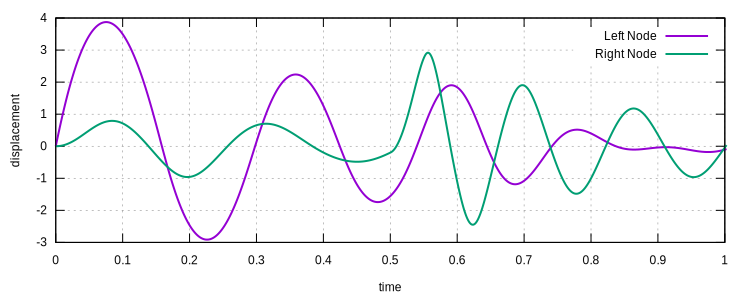
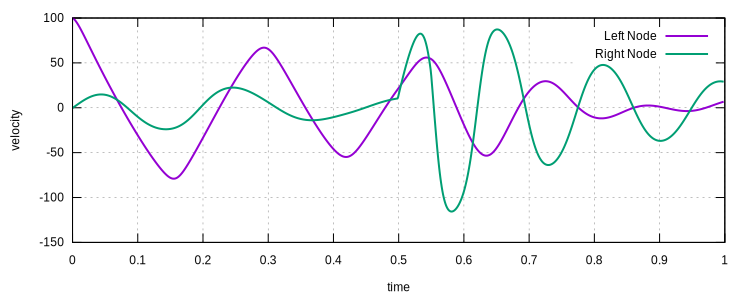

# [★★☆☆☆] Mass-Spring-Dashpot System

This example is taken from the ABAQUS benchmark manual, see section 2.6.1.
The original problem is also reported in the research paper,
see [10.1002/nme.1620170902](https://doi.org/10.1002/nme.1620170902).

The model can be [downloaded](mass-spring-dashpot-system.zip).

## The System

The configuration of the model is shown below.


## Numerical Model

### Nodes

There are two DoFs in the system, two masses are connected to fixed points via nonlinear elastic springs.
In order to do so, we define four nodes.

```text
node 1 0 0
node 2 1 0
node 3 2 0
node 4 3 0
```

Here we use unit distance between two adjacent nodes.
If the elements used are based on strain and strain rate, the unit distance is the only correct choice.
If the elements used are based on displacement and velocity, the unit distance is not a must.

### Materials

The left spring uses a $$\tanh$$ function.
To model it, we use [Tanh1D](../../../Library/Material/Material1D/Elastic/Tanh1D.md) material.

```text
material Tanh1D 1 1000
```

The right spring uses a $$\sinh$$ function.
To model it, we use [Sinh1D](../../../Library/Material/Material1D/Elastic/Sinh1D.md) material.

```text
material Sinh1D 3 1000
```

The middle spring is a linear spring, we simply
use [Elastic1D](../../../Library/Material/Material1D/Elastic/Elastic1D.md) material.

```text
material Elastic1D 2 100
```

The dashpot is linear. We use $$\alpha=1$$
in [Viscosity01](../../../Library/Material/Material1D/Viscosity/Viscosity01.md) material.
The viscosity coefficient is $$5$$.

```text
material Viscosity01 4 1 5
```

### Elements

The springs can be modelled by using either [T2D2](../../../Library/Element/Truss/T2D2.md), which uses strain and strain
rate as the basic quantities, or [Spring01](../../../Library/Element/Special/Spring01.md), which users displacement and
velocity as the basic quantities.

```text
element Spring01 1 1 2 1
element Spring01 2 2 3 2
element Spring01 3 3 4 3
```

For a linear dashpot, we use [Damper01](../../../Library/Element/Special/Damper01.md).

```text
element Damper01 4 2 3 4
```

In addition to the above, it is necessary to define two mass elements.

```text
mass 5 2 1 1
mass 6 3 1 1
```

### IBC

The vertical DoFs of all nodes shall be fixed. The horizontal DoFs of the first and last nodes shall be fixed.

```text
fix2 1 1 1 4
fix2 2 2 1 2 3 4
```

The initial condition can be applied to node 2 via

```text
initial velocity 100 1 2
```

### Load

To apply a step load, one shall use tabular amplitude to define the load curve. The following table can be stored in
file `h`.

```text
0 0
0.499999999999 0
0.5 1
0.55 1
0.550000000001 0
100 0
```

Then the load can be applied such that

```text
amplitude Tabular 1 h

cload 1 1 3000 1 3
```

### Response

To record response, we define two recorders, one for displacement, one for velocity.

```text
hdf5recorder 1 Node U1 2 3
hdf5recorder 2 Node V1 2 3
```

### Step and Analysis

The remaining settings are pretty standard. We use a dynamic step with a default integration
scheme ([Newmark](../../../Library/Integrator/Newmark/Newmark.md)).
If one wishes, other integration schemes can be used.

```text
step dynamic 1 1
set ini_step_size 1E-3
set fixed_step_size 1

converger RelIncreDisp 1 1E-11 10 1

analyze

save recorder 1 2

exit
```

## Results

One could compare the results with the original results in the paper.




