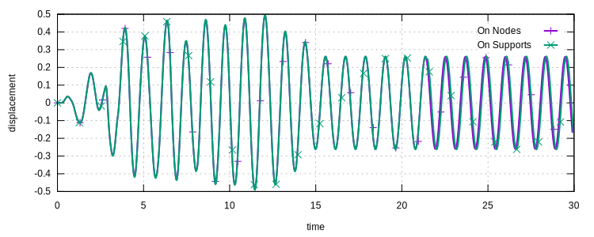

# [★★☆☆☆] Multi-Support Excitation

In this example, we illustrate how to perform response history analysis with multiple support excitations.

The model can be downloaded [here](multi-support-excitation.zip).

The multiple support excitation refers to different prescribed motions at various supports. The general discussion of
linear elastic systems, as presented in typical textbooks (see for
example [Chopra's textbook](https://www.pearson.com/us/higher-education/program/Chopra-Dynamics-of-Structures-5th-Edition/PGM1101746.html))
, is somehow not suitable to numerical implementation.

The implementation in `suanPan` converts whatever support excitations applied to prescribed displacements and the
displacement controlled algorithm [`MPDC`](../../../Library/Solver/MPDC.md) is automatically enabled to solve the
system.

Thus, support excitations in forms of displacement, velocity and acceleration are supported.

## A Simple Model

Here we first create a simple cantilever beam with additional point mass at the free end. The basic geometry related
commands are stored in file `geometry.sp`.

```
# geometry.sp

node 1 0 0
node 2 0 1

material Elastic1D 1 100 .1

section Rectangle2D 1 12 1 1

element B21 1 1 2 1 6

mass 2 2 10 1

hdf5recorder 1 Node U1 1 2

amplitude Tabular 1 EZ
```

The analysis setting consists of a dynamic step with [`Newmark`](../../../Library/Integrator/Newmark/Newmark.md)
integrator. Those settings are stored in `setting.sp` file.

```
# setting.sp

step dynamic 1 30
set ini_step_size 1E-2
set fixed_step_size true

integrator Newmark 1

converger RelIncreDisp 1 1E-10 4 1

analyze

save recorder 1

exit
```

### Apply Excitation On All Nodes

To apply acceleration excitation on all nodes, the boundary conditions need to be assigned in a normal, conventional way
so that no rigid body motion is allowed.

```text hl_lines="6"
file geometry.sp

fix 1 P 1

# on DoF 1 node 2
acceleration 2 1 -.2 1 2

file setting.sp
```

It shall be noted $-\ddot{u}_g$ is applied.

### Apply Excitation On Support

To apply acceleration excitation on support, the corresponding DoF should not be constrained. Thus, rigid body motions
are expected.

```text hl_lines="6"
file geometry.sp

fix 1 2 1
fix 2 3 1

# on DoF 1 node 1
supportacceleration 2 1 .2 1 1

file setting.sp
```

Now it is ready to perform the analysis.

### Result

Here the displacement of the free end is plotted.



It shall be noted that since rigid body motions are present when excitations are applied to the supports, the relative
displacement needs to be obtained by computing the difference between displacements of target DoF and support.

All time integration methods are implemented in such a way that both ways of applying excitations would yield the same results if they are equivalent theoretically.
This is done by applying algorithm-aware conversion among displacement, velocity and acceleration excitations.
