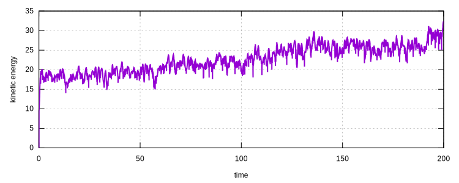

# Simulation of Particle Collision

In this example, we illustrate the contact problem by simulating a 2D particle collision problem. The model can be
downloaded [here](particle-collision.zip).

## General Information

The container is assumed to be a square with edge length of $$10$$. A certain number of nodes are randomly generated
within the container with randomly generated initial velocities. A small program is written to generate the model
script. One could compile the `Generator.cpp` file and run it with the number of particles needed. For example,

```bash
g++ -o Generator.exe Generator.cpp
Generator.exe 20
```

The model file will be generated as `Collision.supan`.

## Collision

The collision force $$F$$ is assumed to be a function of distance $$d$$ between two particles.

$$
F(d)=\alpha\ln\left(\dfrac{d}{s}\right),
$$

where $$s$$ is the approximate size of particles, $$\alpha$$ is a factor that can be used to adjust response. To define
such a collision, one can use

```
particlecollision2d 1 2.
```

in which $$s=2$$ and $$\alpha$$ is defaulted to be unity.

## Container Boundary

The four edges of the container can be assigned by using the rigid wall constraint. For example,

```
rigidwall 2 5 0 0 -1 0 0
rigidwall 3 0 5 0 0 -1 0
rigidwall 4 -5 0 0 1 0 0
rigidwall 5 0 -5 0 0 1 0
```

## Other Caveats

It shall be noted that a full matrix storage scheme shall be enabled to perform a collision simulation, since any two
particles can collide with each other based on different initial conditions, there is no way to obtain a sparse/banded
matrix in advance.

```
set band_mat false
set symm_mat false
```

## Output

The global kinetic energy can be recorded by using

```
hdf5recorder 1 Global KE
```

Besides, it may be helpful to visualize the collision progress, to do that, a `Visualisation` recorder can be defined.

```
hdf5recorder 2 Visualisation U every 20 width 4
```

## Result

The kinetic energy history is obtained as follows. It can be seen that the total energy level is increasing with the
number of collisions. The parameters can be further adjusted for more realistic results. Here the model is presented for
the purpose of illustration.



The animation is presented as follows.


