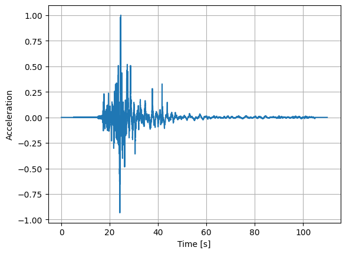
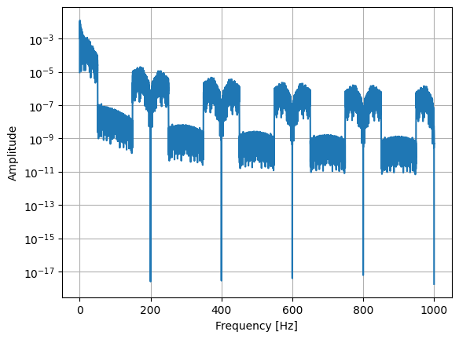
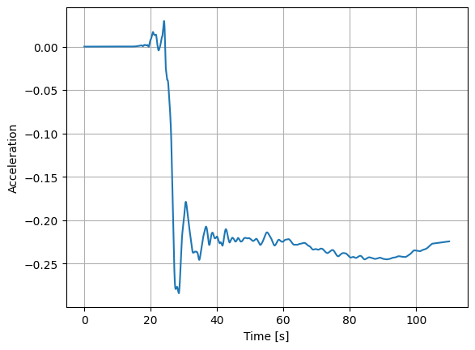
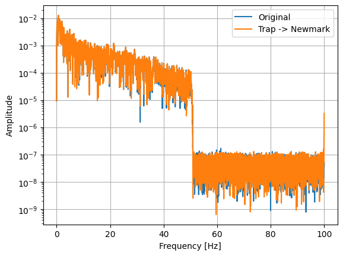
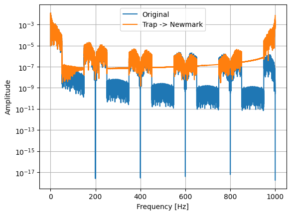
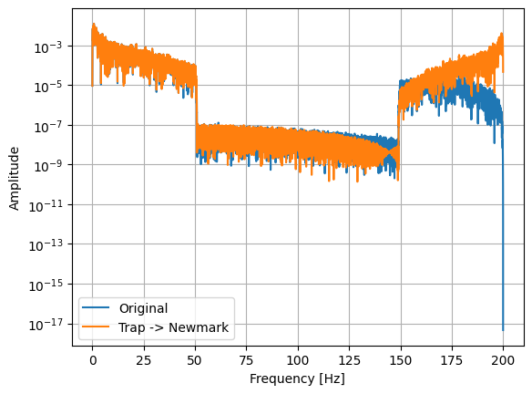

# [★★☆☆☆] Process Ground Motion for Dynamic Analysis

In this example, we mainly introduce and discuss different methods to introduce ground motion into response history analyses.
For different methods, different considerations shall be taken into account.

The ground motion record can be one of acceleration, velocity, or displacement.
Depending on how it is collected, it could either be a processed or raw record.
Typically, seismometer collects acceleration, and velocity and displacement are derived from acceleration.
We assume that analysts are given accelerograms. 

## EOM

The equation of motion is often written as follows, assuming linear elasticity.

$$
\mathbf{M}\ddot{\mathbf{u}}+\mathbf{C}\dot{\mathbf{u}}+\mathbf{K}\mathbf{u}=\mathbf{f}.
$$

To incorporate ground motion in the form of acceleration, one can choose the following methods.

1.  Apply the acceleration on the upper structure, in the form of inertial force, with the assist of the global mass matrix.
    This method involves the global mass matrix $$\mathbf{M}$$, and assumes $$\mathbf{M}$$ is constant, or at least remains constant within the time step.
2.  Apply the ground motion on the supports.
    This method mimics the real-world situation.
    The ground motion is applied on the supports, and the structure is allowed to move freely.
    Thus, final results contain rigid body motion.
    Furthermore, since conventionally displacement is used as the primary unknown, the given acceleration shall be converted to displacement.

## Ground Motion as Inertial Force

The inertial force can be formulated as follows.

$$
\mathbf{f}_g=\mathbf{M}\ddot{\mathbf{u}}_g.
$$

However, when applied in the form of force, there is a risk of unintended spurious force.
One can refer to the paper [10.1080/13632469.2024.2372814](https://doi.org/10.1080/13632469.2024.2372814) for more details.
The conclusion is that, one shall always process the ground motion based on the time step size used in response history analysis, regardless of the source of the ground motion, processed or raw.

## Ground Motion as Support Displacement

The ground motion can also be applied on the supports.
In this case, the ground motion is converted to displacement.
But how?
Naturally, acceleration shall be integrated twice to obtain displacement.
However, the integration process is not straightforward.
Furthermore, not any integration method is suitable for this purpose.

## Example


```python
import json

import numpy as np

with open('process-ground-motion.json', 'r') as f:
    record = json.load(f)

waveform = np.array(record['raw_data'], dtype=float)
waveform /= max(abs(waveform))
dt = record['time_interval']
duration = dt * len(waveform)
```

Let's peek at the ground motion record.


```python
import matplotlib.pyplot as plt


def plot_waveform(_dt, _waveform):
    plt.plot(np.arange(0, _dt * len(_waveform), _dt), _waveform)
    plt.xlabel('Time [s]')
    plt.ylabel('Acceleration')
    plt.grid(True)


plot_waveform(dt, waveform)
```


    

    


Let's also check the frequency content of the ground motion.
It can be done by Fourier transform.


```python
from scipy.fft import rfft, rfftfreq


def plot_freq(_dt, _waveform):
    n = len(_waveform)
    frequencies = rfftfreq(n, _dt)
    fft_values = 2 * np.abs(rfft(_waveform)) / n

    plt.plot(frequencies, fft_values)
    plt.xlabel('Frequency [Hz]')
    plt.ylabel('Amplitude')
    plt.yscale('log')
    plt.grid(True)


plot_freq(dt, waveform)
```


    

    


It appears that the provided ground motion has been filtered using a band-pass filter.
The frequency content above 50 Hz is significantly reduced.

This ground motion is sampled at 200 Hz, with an interval of 0.005 s.
If it is used in a response history analysis with a time step of 0.005 s, the ground motion shall be processed.
The de facto method is to perform linear interpolation.


```python
from scipy.interpolate import interp1d

interp_func = interp1d(np.arange(0, duration, dt), waveform)


def upsample(n):
    _dt = dt / n
    return _dt, interp_func(np.arange(0, duration - dt, _dt))


interp_dt, interp_waveform = upsample(10)
plot_freq(interp_dt, interp_waveform)
```


    

    


From the graph, one shall see that the interpolated acceleration contain significantly large components beyond the original 100 Hz.
It is thus concluded that ***significant spurious response may be present***.

The ground motion can also be converted to displacement by using cumulative integration.


```python
from scipy.integrate import cumulative_trapezoid

disp = cumulative_trapezoid(cumulative_trapezoid(waveform, dx=dt), dx=dt)

plot_waveform(dt, disp)
```


    

    


What acceleration would such a displacement produce if the Newmark method is used?


```python
def newmark(displacement, interval, gamma=.5, beta=.25):
    acceleration: np.ndarray = np.zeros_like(displacement)
    velocity: np.ndarray = np.zeros_like(displacement)
    for i in range(1, len(displacement)):
        acceleration[i] = (displacement[i] - displacement[i - 1] - interval * velocity[i - 1] - (
                0.5 - beta) * interval ** 2 * acceleration[i - 1]) / beta / interval ** 2
        velocity[i] = velocity[i - 1] + (1.0 - gamma) * interval * acceleration[i - 1] + gamma * interval * \
                      acceleration[i]
    return acceleration


acc = newmark(disp, dt)

plot_freq(dt, waveform)
plot_freq(dt, acc)
plt.legend(['Original', 'Trap -> Newmark'])
pass
```


    

    


In the above, we use Newmark method to compute the acceleration that corresponds to the integrated displacement.
By comparing two accelerations records (original ground motion and converted from the integrated displacement), we could see some slight differences.
Such differences appear to be negligible.

However, if the acceleration is linearly interpolated, what would such a process bring?


```python
from scipy.integrate import cumulative_simpson


def double_convert(_dt, _waveform):
    return newmark(cumulative_simpson(cumulative_simpson(_waveform, dx=_dt), dx=_dt), _dt)


plot_freq(interp_dt, interp_waveform)
plot_freq(interp_dt, double_convert(interp_dt, interp_waveform))
plt.legend(['Original', 'Trap -> Newmark'])
pass
```


    

    


It seems the high frequency noise is significantly larger if the acceleration is integrated using an arbitrary integration method.
Let's choose a different upsampling rate.


```python
interp_dt, interp_waveform = upsample(2)
plot_freq(interp_dt, interp_waveform)
plot_freq(interp_dt, double_convert(interp_dt, interp_waveform))
plt.legend(['Original', 'Trap -> Newmark'])
pass
```


    

    


From the figure, one can assert that, if the structure responds to 200 Hz signals, the response could be significant as by choosing to integrate the acceleration using a method that is different from the one used in response history analysis (here, the Newmark method).

## Remarks

In the above example, we have demonstrated two things.

1.  As discussed in [10.1080/13632469.2024.2372814](https://doi.org/10.1080/13632469.2024.2372814), when ground motion is applied in the form of inertial force, linear interpolation of acceleration introduces high frequency noise, the amplitude of which could be relatively large. This would introduce spurious responses.
2.  When ground motion is applied in the form of support displacement, an inconsistent integration method that is used to integrate acceleration to displacement could introduce high frequency noise as well, if the integration method is different from the one used in response history analysis. This type of spurious response is not significant if the acceleration is not linear interpolated.

In conclusion, analysts shall be aware of two things.

1.  Linear interpolation is bad. It shall be avoided, or at least cannot be used alone.
2.  When converting acceleration to displacement, or vice versa, the integration method shall be consistent with the one used in response history analysis.

No matter what, the applied load, in the form of either inertial force or support displacement, shall be processed based on the time step size used in response history analysis.
