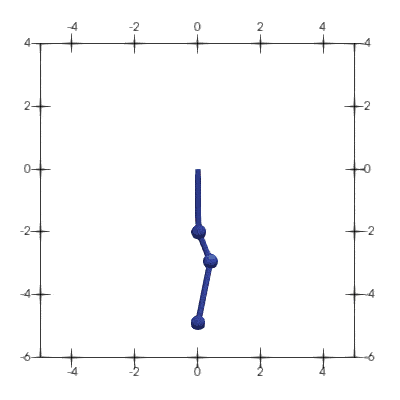

# [★★★★☆] Triple Pendulum

Minimum version: v2.4

The model can be downloaded [here](triple-pendulum.zip).

The main purpose of this example is two-fold:

1. to illustrate how a dynamic system can be analysed, and
2. to show different performance of different time integration methods.

## Model

Such a model for pendulum can be established using two main approaches. As a triple pendulum, the model has four nodes.

```text
node 1 0 0
node 2 0 -2
node 3 0 -3
node 4 0 -5

fix2 1 P 1
```

The first node is pinned so that it does not move.

### With Rigid Links

By using rigid truss elements, the inextensible links can be approximated given that if the rigidity is sufficiently
large. Define the corresponding truss elements and point masses. Note here since the fixed node `1` is connected to the
truss element `1`, there is no need to assign mass to it.

```text
# with rigid links
material Elastic1D 1 1E7

element T2D2 1 1 2 1 1 true
element T2D2 2 2 3 1 1 true
element T2D2 3 3 4 1 1 true

element Mass 4 2 20 1 2
element Mass 5 3 10 1 2
element Mass 6 4 20 1 2
```

Note the nonlinear geometry switch is on to account for large displacement (but still small deformation).

### With Constraints

Alternatively, the [`FixedLength`](../../../Library/Constraint/FixedLength.md) constraint can be used to apply the
inextensible constraints.

```text
constraint FixedLength2D 10 1 2
constraint FixedLength2D 11 2 3
constraint FixedLength2D 12 3 4

element Mass 1 1 1 1 2 ! important
element Mass 2 2 20 1 2
element Mass 3 3 10 1 2
element Mass 4 4 20 1 2
```

Note here, compared to the previous approach, since the fixed node `1` is now not connected to any truss elements, 
it will be associated to nothing if no point mass is assigned to it. This is not allowed. Such an 'isolated' dummy 
node will be identified and automatically **disabled** during the initialisation stage. In order to avoid this, it is 
**necessary** to assign a point mass to it.

### Initial Conditions and Other Setup

An initial velocity is assigned to node `3`.

```text
initial velocity 25 1 3
```

The gravity load is assigned in form of constant force.

```text
amplitude Constant 1
cload 1 1 -200 2 2
cload 2 1 -100 2 3
cload 3 1 -200 2 4
```

There is no essential difference whether to assign the gravity load to node `1` as it is fixed. The applied load 
will be balanced out by the resistance. This only affects how the results shall be processed.

## Analyse

The analysis is performed with the Newmark integration method.

```text
step dynamic 1 100
set ini_step_size 1E-3
set fixed_step_size 1
set symm_mat 0

integrator Newmark 1

converger AbsIncreDisp 1 1E-10 10 1

analyze
```

## Results

The animation is presented as follows.



## What's Next?

Everything seems to be working fine, which appears to be good. So what's next? If the results are carefully examined,
one would notice some unexpected behaviour. For ones who have a good background of dynamics, it must be noticed that 
he Newmark method has no algorithm damping. It is also not ideal in terms of energy/momentum conservation.

Try the extra two models using [`BatheTwoStep`](../../../Library/Integrator/BatheTwoStep.md) and [`GSSSS`](../../..
/Library/Integrator/GSSSS.md) methods in the archive.
