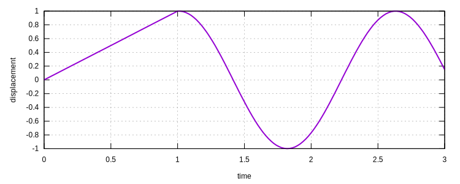

# [★★★☆☆] Vibration of A Displaced Beam

We consider an analysis that combines both static and dynamic steps. A simple cantilever beam with point mass is
displaced in the static step and released in the dynamic step.

The model can be [dowloaded](vibration-of-a-displaced-beam.supan).

## Model Definition

First, we define two nodes at $$(0,0)$$ and $$(1,0)$$.

```
node 1 0 0
node 2 1 0
```

To simply the example, we use elastic material and the `EB21` element, so that there is no need to define beam sections.
A point mass of magnitude of $$2$$ is applied to node $$2$$ DoF $$2$$.

```
material Elastic1D 1 10
element EB21 1 1 2 12 1 1
element Mass 2 2 2 2
```

Then we fix point $$1$$.

```
fix 1 P 1
```

We record the displacement of node $$2$$ as the result.

```
hdf5recorder 1 Node U2 2
```

## Static Step

For the static step, a displacement load is applied on node $$2$$ DoF $$2$$. The absolute increment displacement is
tested for convergence.

```
step static 1 1
set ini_step_size .1

displacement 1 0 1 2 2

converger AbsIncreDisp 1 1E-8 3 1
```

## Dynamic Step

A dynamic step with step size of $$2$$ can then be defined. There is no need to define any load in this step. The
previous displacement load is by default active for only one step. Hence, in this dynamic step, the displacement load is
automatically suspended. A default `Newmark` integrator will be automatically defined if there is no valid integrator.

```
step dynamic 2 2
set ini_step_size .02
set fixed_step_size 1

converger AbsIncreDisp 2 1E-8 3 1
```

## Run Analysis

```
analyze

save recorder 1

exit
```

## Result

The displacement history can be plotted as follows.


