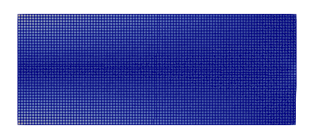

# Evolutionary Structural Optimization of A Cantilever Beam

In this example, the optimization of a loaded panel is performed by using the BESO method. The model can be
downloaded [here](evolutionary-structural-optimization.zip).

## Design Domain

The design domain has a dimension of $$100\times40$$ with left side fully fixed. At the center of the right side, a
point load is applied. The panel is discretized with $$4000$$ `CP4` elements.

The node and elements are defined in files `node.supan` and `element.supan`. They can be loaded.

```
file node.supan
file element.supan
```

The boundary condition is applied to a group that selects all nodes on $$x=0$$.

```
generatebyrule nodegroup 1 1 1. 0.
groupmultiplierbc 1 P 1
```

## The Optimization Step

To perform structural optimization, a `Optimization` step needs to be defined.

```
step Optimization 1
```

To define a proper rule to update the model by adding/deleting elements, one can use the `StrainEnergyEvolution`
criterion. The following command defines a strain energy based evolution rule with an increment step of $$2\%$$ to reach
the final design level $$50\%$$, that is to remove $$50\%$$ elements.

```
criterion StrainEnergyEvolution 1 2 50 1 1 40
```

## Result


