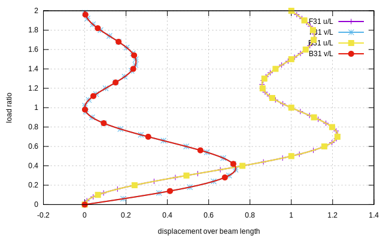
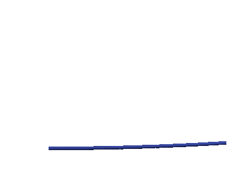

# Bending of A Cantilever Beam

In this example, we show the application of 3D beam elements [`B31`](../../../Library/Element/Beam/B31.md)
and [`F31`](../../../Library/Element/Beam/F31.md) with corotational
transformation [`B3DC`](../../../Library/Element/Beam/Orientation.md).

The model can be [downloaded](bending-of-a-cantilever-beam.supan).

## The Model

A simple cantilever beam is bent at the free end. Since the load and displacements are normalised, geometry does not
affect results. Here we simply choose the following parameters: beam length $$L=20$$, section dimension
$$b\times{}h=2\times2$$ and elastic modulus $$E=10$$.

Here five elements are used. Consequently, six nodes shall be defined.

```
node 1 0 0 0
node 3 4 0 0
node 4 8 0 0
node 5 12 0 0
node 6 16 0 0
node 2 20 0 0
```

The [`Rectangle3D`](../../../Library/Section/Section3D/Rectangle3D.md) section can be used.

```
material Elastic1D 1 10
# size 2x2 using material 1
section Rectangle3D 1 2 2 1
```

Assuming the beam is in the $$xy$$ plane, then strong axis aligns with global $$z$$. To define 3D beam elements, its
section orientation shall be defined. The corotational formulation that supports nonlinear geometry is used.

```
# defining local strong axis pointing to global (0 0 -1)
orientation B3DC 1 0 0 -1.
```

Now define the elements. Replacing `F31` with `B31` to use displacement based elements.

```
element F31 1 1 3 1 1 5 true
element F31 2 3 4 1 1 5 true
element F31 3 4 5 1 1 5 true
element F31 4 5 6 1 1 5 true
element F31 5 6 2 1 1 5 true
```

It is known from the beam theory that a perfect circle would be formed if the free end is applied with an out-of-plane
moment of magnitude $$M=\alpha{}M_0=\alpha\dfrac{2\pi{}EI}{L}$$ with load ratio $$\alpha=1$$, which can be computed to
be 4.188790205. For two circles, $$\alpha=2$$.

Next, we apply boundary condition and load, define recorders to record free end displacements.

```
# E is the shortcut for (1 2 3 4 5 6) all six DoFs
fix2 1 E 1

# apply two circles
cload 1 0 8.377580410 6 2

plainrecorder 1 Node U1 2
plainrecorder 2 Node U2 2
```

It shall be noted since nonlinear geometry is adopted, the stiffness may not be symmetric anymore, it is necessary to
switch off symmetric matrix storage to ensure correct results are computed. Since not all nonlinear geometry problems
are asymmetric, the program itself has no mechanism to check if it is appropriate to use symmetric/asymmetric storage.

```
step static 1
set ini_step_size 1E-2
set fixed_step_size true

set symm_mat false ! important

converger RelIncreDisp 1 1E-8 10 1

analyze
```

## Results

Normalised displacement components are shown in the following figure.



Since VTK does not have a proper cell type for beams, linear lines are used to represent beams. Here is the animation of
deformation.

