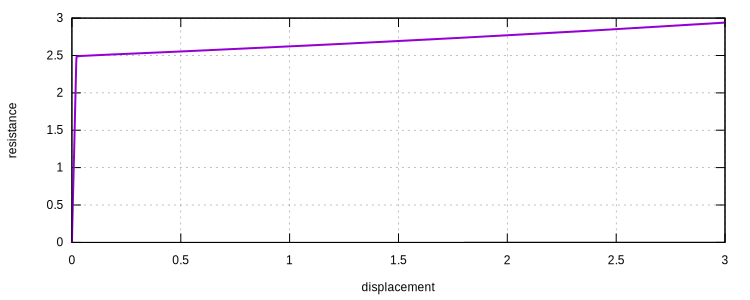

# Bifurcation of A Cantilever Beam

Here we run a full nonlinear geometry analysis of the cantilever beam shown in another
page. [Buckling Analysis of A Cantilever Beam](../Buckling/buckling-analysis-of-a-cantilever-beam.md)

To numerically run a bifurcation analysis, initial perturbation must be introduced. Either geometry imperfection or
initial load can be applied. Here we use initial transverse load.

Since the perturbation does not change its magnitude throughout the analysis procedure, we shall define a constant
amplitude associated with the initial transverse load. The magnitude of the initial load shall be relatively small.

```
! load model geometry
file geometry.supan

! a constant amplitude
amplitude Constant 1

! define the transverse initial load
cload 2 1 1E-4 2 6
```

We use arc length method to track the behavior, this is not necessary for this particular example as there is no
snap-through nor snap-back. The reference load is applied on the free end. For stopping criterion, we use minimum
displacement at the free end.

```
! reference load of magnitude -1 along DoF 1 of node 6
step arclength 1 6 1 -1

! use asymmetric matrix storage
set symm_mat 0

! stop analysis when displacement DoF 1 of node 6 hit -10
criterion MinDisplacement 1 6 1 -10

converger AbsIncreDisp 1 1E-8 5 1

analyze

exit
```

The response is shown as follows.



The buckling load is just under $$2.5$$, agrees with the previous linear buckling analysis.
