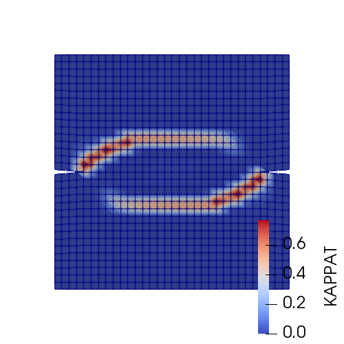
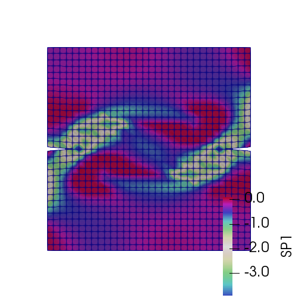
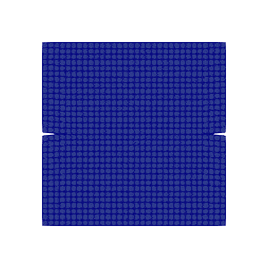

# [★★★☆☆] Double Edge Notched Specimen

The double edge notched specimen was investigated
by [Nooru-Mohamed (1992)](http://resolver.tudelft.nl/uuid:a6a773f1-dacd-4598-aa6a-960dddf71117).

This example is taken from the [thesis](https://doi.org/10.5281/zenodo.3731921). The details of the model can be seen in
Section 6.3.

The model can be downloaded [here](double-edge-notched-specimen.zip).

## Model Setup

The definitions of nodes and elements can be seen in `element_f.supan` and `node_f.supan`.

To ease the work of defining boundary conditions and load, some node groups can be defined first.

In total four edges will be used, here the `generatebypoint` command is used to find all relevant nodes.

```
# find all nodes on the line segment defined by (0,0) and (200,0)
generatebypoint nodegroup 1 0. 0. 200. 0.

# find all nodes on the line segment defined by (200,0) and (200,100)
generatebypoint nodegroup 2 200. 0. 200. 100.

# find all nodes on the line segment defined by (0,200) and (200,200)
generatebypoint nodegroup 3 0. 200. 200. 200.

# find all nodes on the line segment defined by (0,100) and (0,200)
generatebypoint nodegroup 4 0. 100. 0. 200.
```

The boundary conditions are explicitly assigned to the corresponding node groups.

```
# for all four edges, the drilling DoFs are constrained
grouppenaltybc 1 3 1 2 3 4

# constrain horizontal movement of edge 2
grouppenaltybc 2 1 2
# constrain vertical movement of edge 1
grouppenaltybc 3 2 1
```

Two displacement loads are applied. Two files `h` and `v` are used to define the amplitudes.

```
# horizontal dispalcement to generate a 5kN total horizontal tension force
amplitude Tabular 1 h
groupdisplacement 1 1 -16.5E-3 1 4

amplitude Tabular 2 v
groupdisplacement 2 2 .1 2 3
```

If **VTK** is enabled, it is possible to record the distribution of tension damage at each converged substep.

```
hdf5recorder 1 Visualisation DT width 3 scale 0
```

Since we are not interested in the displacement, `scale` is simply set to zero. The output file are automatically
numbered with a total width of four. It is changed to three in this example. The generated `.vtk` files can be loaded
into **ParaView** as a group to generate animations.

The analysis has a duration of two seconds. In the first second, the horizontal tension is applied, then the vertical
load is applied.

```
step static 1 2
set fixed_step_size 1
set ini_step_size 5E-3

converger RelIncreDisp 1 1E-4 20 1
```

## Results

Results are shown as follows, which agree with experimental results.





## Element Deletion

It is possible to further define a criterion so that for elements that exceed a certain value of $$d_t$$, they are
removed from the model. This is an approach adopted widely to simulate crack propagation.

```
criterion MaxHistory 1 DT .8
```

The animation of crack development is shown as follows.



## Performance

See a typical [profiling](double-edge-notched-specimen.html).
