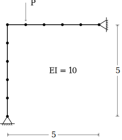
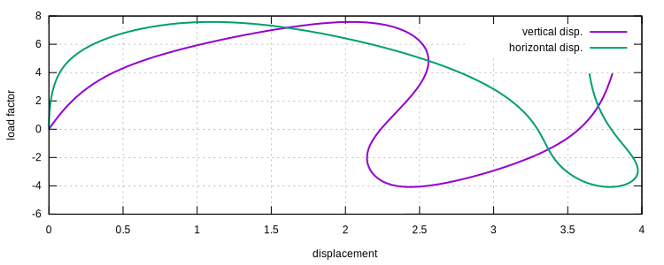

# [★★★☆☆] Lee's Frame

The Lee's frame is shown as follows.



The model can be downloaded. [lees-frame.supan](lees-frame.supan)

## Model Setup

Since this is an elastic analysis, we use `EB21` element to model this problem. To suppress axial deformation, a large
area of $$500$$ is assigned. The node and element definitions can be established as follows.

```
node 1 0 0
node 2 0 1
node 3 0 2
node 4 0 3
node 5 0 4
node 6 0 5
node 7 1 5
node 8 2 5
node 9 3 5
node 10 4 5
node 11 5 5

element EB21 1 1 2 500. 1. 1 1
element EB21 2 2 3 500. 1. 1 1
element EB21 3 3 4 500. 1. 1 1
element EB21 4 4 5 500. 1. 1 1
element EB21 5 5 6 500. 1. 1 1
element EB21 6 6 7 500. 1. 1 1
element EB21 7 7 8 500. 1. 1 1
element EB21 8 8 9 500. 1. 1 1
element EB21 9 9 10 500. 1. 1 1
element EB21 10 10 11 500. 1. 1 1

material Elastic1D 1 10

fix 1 1 1 11
fix 2 2 1 11
```

Both snap-back and snap-through are involved in this example, the arc length method shall be used. A reference load of
magnitude $$-1$$ is applied on the DoF 2 of node 7.

```
step arclength 1 7 2 -1
```

Here the magnitude of reference load matters. A proper selection of reference load may help to converge. By default,
the algorithm automatically scale the arc length until a stopping criterion is met.

To control the solving strategy, one can control arc length by using

```
set ini_step_size .5
set fixed_step_size true
set max_iteration 1000
```

The above command uses a fixed arc length of $$0.5$$. By default, a maximum of $$1000$$ sub
steps are allowed, this may not be sufficient, to change it the `set` command can be called.

```
criterion MinDisplacement 1 7 2 -3.8
```

With the above criterion, when the negative displacement of DoF2 of node 7 reaches $$-3.8$$, the analysis stops.

Now the model can be analyzed.

```
analyze
```

## Result



The sign of vertical displacement is flipped.
