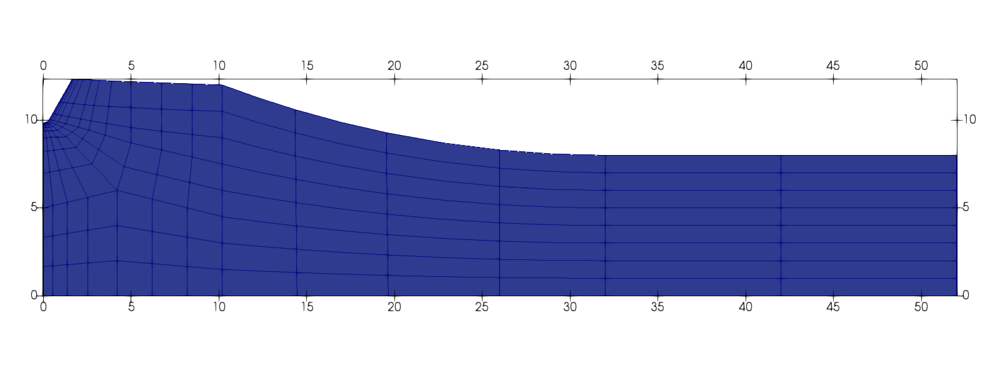
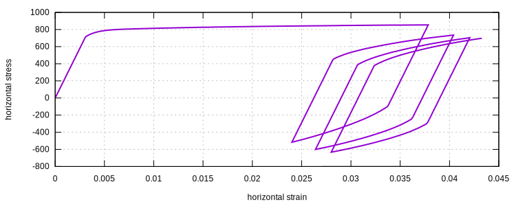
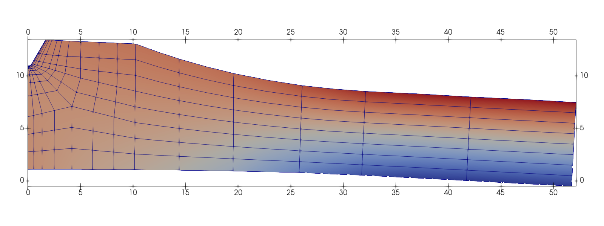

# [★★★☆☆] Notched Beam Under Cyclic Loading

The model scripts can be downloaded from [here](notched-beam-under-cyclic-loading.zip).

This example is taken from section 1.1.7 in the manual "ABAQUS Example Problems Guide". Additional references are
available:

1. [https://doi.org/10.1002/nme.1620362210](https://doi.org/10.1002/nme.1620362210)
2. [https://doi.org/10.1002/cnm.1630040606](https://doi.org/10.1002/cnm.1630040606)

## Geometry

The model is depicted as follows.



## Material Parameters

The [Armstrong-Frederick](../../../Library/Material/Material3D/vonMises/ArmstrongFrederick.md) model is used to model
the behavior of the rolled steel. An elastic modulus of $$E=210~\mathrm{GPa}$$ and a Poisson's ratio of $$\nu=0.3$$ are
used. The initial yield stress is $$\sigma_y=200~\mathrm{MPa}$$.

### Isotropic Hardening

The same exponential function with a saturated limit is used in both AF model and the ABAQUS implementation.

$$
k(p)=\sigma_y+k_s(1-e^{-mp})+k_lp,
$$

in which the following parameters are used: $$k_s=2000~\mathrm{MPa}$$, $$m=0.26$$ and $$k_l=0~\mathrm{MPa}$$.

### Kinematic Hardening

A slightly different rule is used in the ABAQUS implementation compared to that in the AF model. The linear part of the
back stress $$\beta$$ is proportional to the shifted stress $$\eta$$, rather than its unit direction
$$n=\dfrac{\eta}{|\eta|}$$. Please refer to the description of the AF model for the meanings of those symbols.

In the ABAQUS implementation, the following rate form is used.

$$
\mathrm{d}\beta=C\dfrac{1}{\sigma_y}\left(s-\beta\right)p-\gamma\beta{}p,
$$

in which $$C=25.5~\mathrm{GPa}$$ and $$\gamma=81$$ are used.

The AF model uses the following form.

$$
\mathrm{d}\beta=a\dfrac{s-\beta}{|s-\beta|}p-b\beta{}p.
$$

In this form, the parameter $$C$$ shall be defined as a function. For simplicity, a constant but smaller value can be
used for $$a<C$$ while $$b=\gamma$$.

### Initial Condition

Initial accumulated plastic strain and back stress are defined so that

$$
p_0=0.43,\qquad\beta_0=\begin{bmatrix}128&-181&53&0&0&0\end{bmatrix}^\mathrm{T}.
$$

## Numerical Model

The following commands can be used to define the model. Note since it is a plane strain problem, the corresponding
wrapper is used. Also note due to the different implementation of kinematic hardening, exact result is not possible.

```
material ArmstrongFrederick 1 2.1E5 .3 2E2 2E3 0 .26 2E4 81
initial material history 1 .43 128 -181 53
material PlaneStrain 2 1
```

## Results

The response of the root of the notch is plotted as follows.



The deformation is shown.


