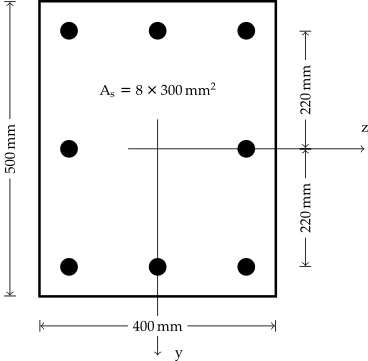
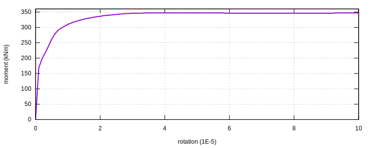

# [★★★☆☆] Reinforced Concrete Section Analysis

In this page, the analysis of a rectangular reinforced concrete section of a 2D beam is performed to compute the full
plastic moment. This is achieved by using the [`SingleSection2D`](../../../Library/Element/Special/SingleSection.md)
element. There is no need to create a larger model.

The model can be downloaded. [rc-section-analysis.supan](rc-section-analysis.supan)

## Section Definition

The section configuration is shown as follows.



## Model Development

The [`SingleSection2D`](../../../Library/Element/Special/SingleSection.md) element is **NOT** a connector element.
Only one node is required to define the element.
First, we define an arbitrary node.

```
node 1 0 0
```

For material models, we use a simple concrete model that adopts Tsai's
backbone [`ConcreteTsai`](../../../Library/Material/Material1D/Concrete/ConcreteTsai.md) and
the [`MPF`](../../../Library/Material/Material1D/Hysteresis/MPF.md) steel model.

```
material ConcreteTsai 1 30. 3. 2. 2. 2. 2. .2 2E-3 1E-4
material MPF 2 2E5 400 .01
```

With the above definition, we have $$f_c=30~\text{MPa}$$, $$f_t=3~\text{MPa}$$, $$\varepsilon_c=0.002$$,
$$\varepsilon_t=0.0001$$, $$E=200~\text{GPa}$$ and $$f_y=400~\text{MPa}$$. For detailed material definitions, please
refer to the corresponding pages.

Now we define a rectangular concrete section with the dimension of $$400~\text{mm}\times500~\text{mm}$$ and nine
integration points along section height. Since it is a 2D section, it is meaningless to define multiple integration
points along $$z$$ axis. All 2D sections only use 1D integration schemes along $$y$$ axis.

```
section Rectangle2D 2 400. 500. 1 9
```

Now define some rebars. The eccentricities are $$\pm220~\text{mm}$$ and $$0~\text{mm}$$.

```
section Bar2D 3 900. 2 220.
section Bar2D 4 900. 2 -220.
section Bar2D 5 600. 2 0.
```

To combine those independent sections into a whole, we use
the [`Fibre2D`](../../../Library/Section/Section2D/Fibre2D.md) section. It is a wrapper that wraps all valid sections
into one piece. Accordingly, a [`SingleSection2D`](../../../Library/Element/Special/SingleSection.md) element can be
defined.

```
section Fibre2D 1 2 3 4 5
element SingleSection2D 1 1 1
```

Before defining steps, we first create two recorders to record nodal reactions and displacements.

```
hdf5recorder 1 Node RF 1
hdf5recorder 2 Node U 1
```

If the axial deformation shall be suppressed, the first DoF needs to be restrained. Here, instead of doing that, we
apply an axial force of $$10\%$$ section capacity, which is $$600~\text{kN}$$.

```
step static 1
set ini_step_size 1E-1
set fixed_step_size 1
set symm_mat 0

cload 1 0 -6E5 1 1

converger AbsIncreDisp 1 1E-10 20 1
```

Now in the second step, a rotation of $$10^{-4}$$ is applied on the second DoF.

```
step static 2
set ini_step_size 1E-2
set fixed_step_size 1
set symm_mat 0

displacement 2 0 1E-4 2 1

converger AbsIncreDisp 2 1E-10 20 1
```

## Result

Perform the analysis, the rotation versus moment can be plotted. The maximum moment under such a loading configuration
is about $$350~\text{kNm}$$.



Users with a relative background may help to justify the result.

### Asymmetric Layout

If the layout is asymmetric, say, for example, the rebars at $$y=-220~\text{mm}$$ are removed.

```text
section Rectangle2D 2 400. 500. 1 9
section Bar2D 3 900. 2 220.
# section Bar2D 4 900. 2 -220.
section Bar2D 5 600. 2 0.
```

In this case, a positive moment makes the unreinforced region in tension.
This decreases the moment capacity.
However, a negative moment does not change the moment capacity significantly.

Interested readers can try to apply both positive and negative rotation and verify the results.
