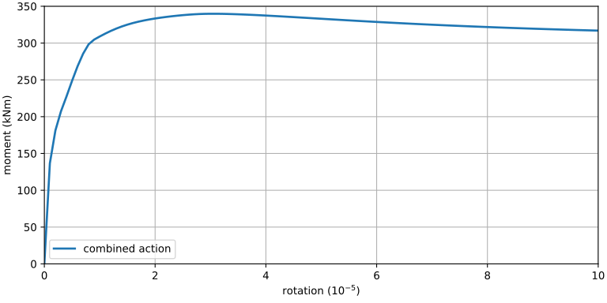
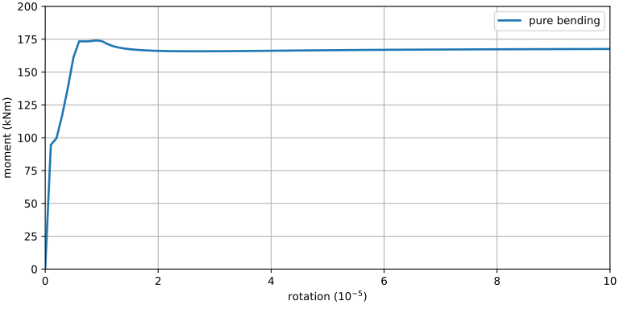

# [★★★☆☆] Reinforced Concrete Section Analysis

In this page, the analysis of a rectangular reinforced concrete section of a 2D beam is performed to compute the full plastic moment.
This is achieved by using the [`SingleSection2D`](../../../Library/Element/Special/SingleSection.md) element.
There is no need to create a larger model.

The model can be [downloaded](rc-section-analysis.zip).

## Section Definition

The section configuration is shown as follows.


## Model Development

The [`SingleSection2D`](../../../Library/Element/Special/SingleSection.md) element is **not** a connector element.
It is a convenient wrapper to allow section analysis without the need to create a full model.
Thus, only one node is required to define the element.
First, we define an arbitrary node, coordinates do not matter.

```
node 1 0 0
```

For material models, we use a simple concrete model that adopts Tsai's
backbone [`ConcreteTsai`](../../../Library/Material/Material1D/Concrete/ConcreteTsai.md) and
the [`MPF`](../../../Library/Material/Material1D/Hysteresis/MPF.md) steel model.

Note there is a breaking change introduced in `v3.3` which changed the syntax of [`ConcreteTsai`](../../../Library/Material/Material1D/Concrete/ConcreteTsai.md).

```
# prior to v3.3
# material ConcreteTsai 1 30. 3. 2. 2. 2. 2. .2 2E-3 1.4E-4
# from v3.3
material ConcreteTsai 1 3E4 30 3 2 2 .2 2E-3 1.4E-4
material MPF 2 2E5 400 .01
```

With the above definition, we have $$f_c=30~\text{MPa}$$ and $$f_t=3~\text{MPa}$$ for concrete, $$E=200~\text{GPa}$$ and $$f_y=400~\text{MPa}$$ for steel.
For detailed material definitions, please refer to the corresponding pages.

Now we define a rectangular concrete section with the dimension of $$400~\text{mm}\times500~\text{mm}$$ and nine integration points along section height.
Since it is a 2D section, it is meaningless to define multiple integration points along the $$z$$ axis.
All 2D sections only use 1D integration schemes along $$y$$ axis.

```
section Rectangle2D 2 400. 500. 1 9
```

Now define some rebars.
The eccentricities are $$\pm220~\text{mm}$$ and $$0~\text{mm}$$.
This means the cover thickness is $$30~\text{mm}$$ (center to edge) or $$20~\text{mm}$$ (net, edge to edge).

```
section Bar2D 3 900. 2 220.
section Bar2D 4 900. 2 -220.
section Bar2D 5 600. 2 0.
```

To combine those independent sections into a whole, we use the [`Fibre2D`](../../../Library/Section/Section2D/Fibre2D.md) section.
It is a wrapper that wraps all valid sections into one piece.
Accordingly, a [`SingleSection2D`](../../../Library/Element/Special/SingleSection.md) element can be defined.

```
# a fibre section using the above sections 2, 3, 4, and 5
section Fibre2D 1 2 3 4 5
element SingleSection2D 1 1 1
```

Before defining steps, we first create two recorders to record nodal reactions and displacements.

```
hdf5recorder 1 Node RF 1
hdf5recorder 2 Node U 1
```

If the axial deformation shall be suppressed, the first DoF needs to be restrained.
Here, instead of doing that, we apply an axial force of $$10\%$$ section capacity, which is $$0.1\times400\times500\times30/1000=600~\text{kN}$$.

``` hl_lines="6"
step static 1
set ini_step_size 1E-1
set fixed_step_size 1
set symm_mat 0

cload 1 0 -6E5 1 1

converger AbsIncreDisp 1 1E-10 20 1
```

Now in the second step, a rotation of $$10^{-4}$$ is applied on the second DoF.

``` hl_lines="6"
step static 2
set ini_step_size 1E-2
set fixed_step_size 1
set symm_mat 0

displacement 2 0 1E-4 2 1

converger AbsIncreDisp 2 1E-10 20 1
```

## Results

### Combined Action

Performing the analysis, the rotation versus moment can be plotted.
The maximum moment under such a loading configuration is about $$350~\text{kNm}$$.



Readers with relevant background may help to justify the result.

### Pure Bending

By removing the axial load, the section now undergoes pure bending.



The maximum moment under such a loading configuration is about $$220~\text{kNm}$$.

One can quickly compute a rough estimate of the moment capacity.
The compression depth of concrete section can be calculated via axial equilibrium.
Assuming only the bottom rebars are effective, steel tension force shall be equal to the concrete compression force, this gives the depth of compression region as

$$
d'=\dfrac{400~\text{MPa}\times900~\text{mm^2}}{400~\text{mm}\times30~\text{MPa}}=30~\text{mm}.
$$

Taking moment about the center of the compression region, the moment capacity is

$$
M=400~\text{MPa}\times900~\text{mm^2}\times\left(500~\text{mm}-30~\text{mm}-30~\text{mm}\right)=160~\text{kNm}.
$$

!!! warning "just a rough estimate"
    The above procedure is nothing but a rough estimate.
    The actual engineering practice may follow a more rigorous procedure.

### Asymmetric Layout

If the layout is asymmetric, say, for example, the rebars at $$y=-220~\text{mm}$$ are removed.

```text hl_lines="3 5"
section Rectangle2D 2 400. 500. 1 9
section Bar2D 3 900. 2 220.
# section Bar2D 4 900. 2 -220.

section Fibre2D 1 2 4
```

In this case, a positive moment/rotation makes the unreinforced region in tension.
This decreases the moment capacity.
However, a negative moment does not change the moment capacity significantly.

Interested readers can try to apply both positive and negative rotation and verify the results.
