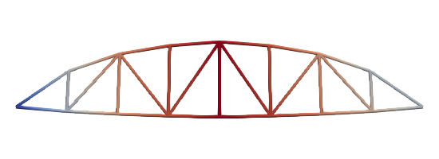

# Linear Analysis of A Truss Roof

The model can be downloaded. [truss-roof.zip](truss-roof.zip)

## Model

Definitions of nodes and elements are stored in files `node` and `element`.

```
file node
file element

material Elastic1D 1 30E3

fix2 1 1 14
fix2 2 2 14 16

displacement 1 0 -1 2 3

step static 1
set ini_step_size 1
set fixed_step_size true

converger AbsIncreDisp 1 1E-8 10 1

analyze

exit
```

## Results


