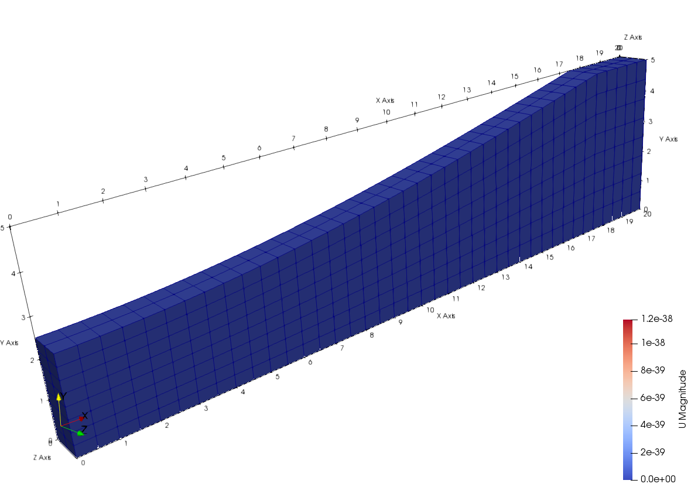
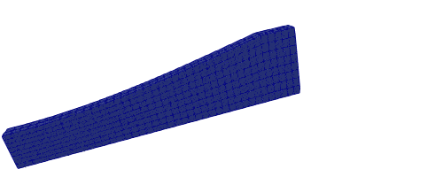

# [★★☆☆☆] Uniform Tension of A Rubber Specimen

In this page, a rubber specimen is modelled using solid elements and Mooney-Rivlin material.

Only a quarter of the specimen is modelled considering symmetry. The geometry can be seen as follows. The model can be
downloaded. [uniform-tension-of-a-rubber-specimen.zip](uniform-tension-of-a-rubber-specimen.zip)



## Model Setup

The node and element information can be seen in `node.supan` and `element.supan`, the mesh is generated by ABAQUS, it is
easy to adapt ABAQUS input file to be used here. `C3D8` element with full integration and nonlinear geometry is used.

```
file node.supan
file element.supan
```

After loading nodes and elements, a `MooneyRivlin` material is defined with $$C_1=80~\text{MPa}$$, $$C_2=20~\text{MPa}$$
and $$K=10^6~\text{MPa}$$. This is a regularized version of Mooney-Rivlin model that allows a certain degree of
dilatation. The $$D_1$$ parameter used in ABAQUS is the inverse of bulk modulus so that $$D_1=0$$ means fully
incompressible. The displacement of magnitude of $$10$$ along $$x$$ axis is applied on the free end. A static step with
an initial step size of $$0.01$$ is used. With `fixed_step_size` off, the algorithm automatically scale step size based
on convergence performance.

```
material MooneyRivlin 1 1E6 80 20
```

To generate the node groups to be used to apply boundary conditions, here the `generatebyplane` command is used.

```
# all nodes on plane x=0
generatebyplane nodegroup 1 1. 0. 0. 0.
# all nodes on plane y=0
generatebyplane nodegroup 2 0. 1. 0. 0.
# all nodes on plane z=0
generatebyplane nodegroup 3 0. 0. 1. 0.
# all nodes on plane x=20
generatebyplane nodegroup 4 1. 0. 0. -20.
```

Now BCs and loads can be applied.

```
grouppenaltybc 1 1 1
grouppenaltybc 2 2 2
grouppenaltybc 3 3 3

groupdisplacement 1 0 10 1 4
```

Setup steps and perform the analysis.

```
step static 1
set fixed_step_size 0
set ini_step_size 1E-2
set symm_mat 0

converger AbsIncreDisp 1 1E-8 10 1

analyze

exit
```

## Result


