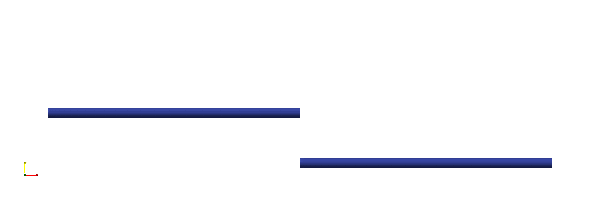

# MaxForce

The `MaxForce` constraint applies a [`FixedLength`](FixedLength.md) constraint to a pair of nodes.
The constraint is only active when the force is below a specified threshold.

## Syntax

```
maxforce2d (1) (2) (3) (4)
maxforce3d (1) (2) (3) (4)
constraint maxforce2d (1) (2) (3) (4)
constraint maxforce3d (1) (2) (3) (4)
# (1) int, unique constraint tag
# (2) int, node tag
# (3) int, node tag
# (4) double, magnitude of constraint force
```

## Example



A vertical displacement is applied to the free end of the top beam.
The free ends of the two beams are connected by a `MaxForce2D` constraint.

```text
node 1 0 0
node 2 1 0
node 11 .2 0
node 12 .4 0
node 13 .6 0
node 14 .8 0

node 3 1 -.2
node 4 2 -.2
node 21 1.2 -.2
node 22 1.4 -.2
node 23 1.6 -.2
node 24 1.8 -.2

material Elastic1D 1 10 1E-4

element EB21 1 1 11 12 1 1 1
element EB21 2 11 12 12 1 1 1
element EB21 3 12 13 12 1 1 1
element EB21 4 13 14 12 1 1 1
element EB21 5 14 2 12 1 1 1

element EB21 6 3 21 12 1 1 1
element EB21 7 21 22 12 1 1 1
element EB21 8 22 23 12 1 1 1
element EB21 9 23 24 12 1 1 1
element EB21 10 24 4 12 1 1 1

fix2 1 P 1 4

constraint MaxForce2D 2 2 3 4.0

displacement 1 0 .3 2 2

step dynamic 1 1
set ini_step_size 1E-2
set fixed_step_size true
set symm_mat false

converger RelIncreDisp 1 1E-10 10 1

analyze

exit
```
