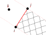

# NodeLine

The `NodeLine` constraint implements 2D node-line contact via Lagrangian multiplier method.

## Syntax

```
constraint NodeLine (1) (2) (3) (4)
# (1) int, unique constraint tag
# (2) int, master node i tag
# (3) int, master node j tag
# (4) int, slave node k tag
```

The geometry can be illustrated in the following figure.



This constraint is intended to model the line-crossing style contact.
In most cases, the whole plane can be divided into two regions, separated by a series of line segments, one side shall be the no-entry zone.
The target slave nodes are constrained in such way that they can only stay on the initial side. 

Nodes $$i$$ and $$j$$ define a line segment with a finite length.
Node $$k$$ is not allowed to enter the  shaded region on opposite side of the line.
It can, however, enter the unshaded regions on either side.
The initial positions of three nodes define the initial side of node $$k$$.

!!! warning "limited applicability"
    This constraint is **not** suitable for some problems involving large displacement, or large rigid body motion, in which there are no clear rules that target slave nodes must stay on one side of some boundary. 

!!! note "node order"
    Prior to `v4.0.0`, node $$k$$ must be on the **left** side of vector $$ij$$, as the normal direction is computed by rotating vector $$ij$$ anticlockwise by 90 degrees.
    Starting from `v4.0.0`, this restriction is **lifted** so the order of nodes $$i$$ and $$j$$ does not matter any more.
