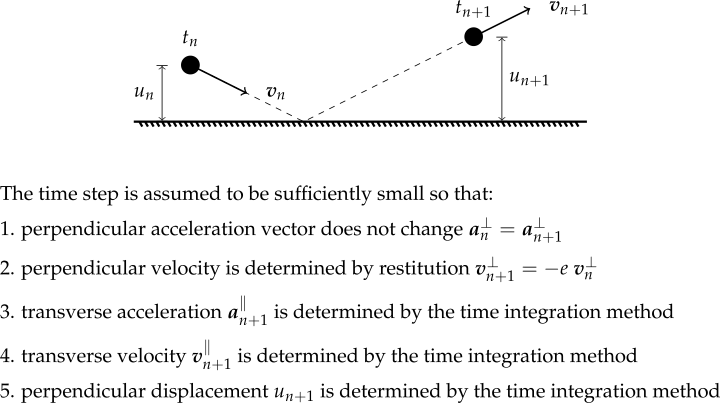
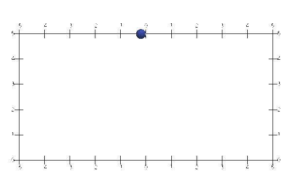
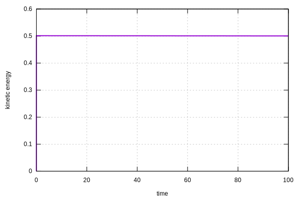

# RestitutionWall

The [`RigidWall`](RigidWall.md) constraint essentially implements artificial springs to alter the trajectories of 
nodes. The physical implication is clear but the main issue is that the conservation of energy/momentum cannot be 
guaranteed.

The `RestitutionWall` constraint adopts a different approach to ensure the assigned restitution is satisfies. If the 
coefficient of restitution is set to unity, conservation of energy/momentum is guaranteed.

## Syntax

The rigid wall constraints are single sided. Travelling against the outer normal direction is not allowed while the 
other direction is permitted.

### 1D

The 1D version takes the origin and the side of the wall as the inputs.

```
! infinite rigid wall by penalty
restitutionwall (1) (2) (3) (4) [5]
constraint restitutionwall (1) (2) (3) (4) [5]
# (1) int, unique constraint tag
# (2) double, coordinate of origin of rigid wall
# (3) double, sign of normal direction +1 or -1
# (4) double, restitution coefficient
# [5] double, multiplier, default: 1E4
```

### 2D

The 2D version takes the origin and either the edge vector or the normal vector as the inputs.

```
! infinite rigid wall by penalty
rigidwall (1) (2...3) (4...5) (6) [7]
constraint rigidwall (1) (2...3) (4...5) (6) [7]
# (1) int, unique constraint tag
# (2...3) double, coordinates of origin of rigid wall
# (4...5) double, vector of normal direction
# (6) double, restitution coefficient
# [7] double, multiplier, default: 1E4

! finite rigid wall by penalty
finiterigidwall (1) (2...3) (4...5) (6) [7]
constraint finiterigidwall (1) (2...3) (4...5) (6) [7]
# (1) int, unique constraint tag
# (2...3) double, coordinates of origin of rigid wall
# (4...5) double, vector of wall edge
# (6) double, restitution coefficient
# [7] double, multiplier, default: 1E4
```

### 3D

The 3D version takes the origin and the normal vector as the inputs. Alternatively, two edges can be specified to 
define a finite wall.

```
! infinite rigid wall by penalty
rigidwall (1) (2...4) (5...7) (8) [9]
constraint rigidwall (1) (2...4) (5...7) (8) [9]
# (1) int, unique constraint tag
# (2...4) double, coordinates of origin of rigid wall
# (5...7) double, vector of normal direction
# (8) double, coefficient of restitution
# [9] double, multiplier, default: 1E4

! finite rigid wall by penalty
finiterigidwall (1) (2...4) (5...7) (8...10) (11) [12]
constraint finiterigidwall (1) (2...4) (5...7) (8...10) (11) [12]
# (1) int, unique constraint tag
# (2...4) double, coordinates of origin of rigid wall
# (5...7) double, vector of first edge
# (8...10) double, vector of second edge
# (11) double, coefficient of restitution
# [12] double, multiplier, default: 1E4
```


## Assumptions

It is assumed that the collision occurs within a very short time. As a result, the change of acceleration is not 
reflected at either $$t_n$$ or $$t_{n+1}$$. The assumptions adopted are shown in the following figure.



## Example

See [Bouncing of A Ball](../../Example/Structural/Dynamics/bouncing-of-a-ball.md).

Another validation can be [downloaded](RestitutionWall.supan).



The kinetic energy is conserved.


