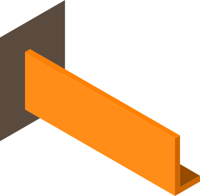
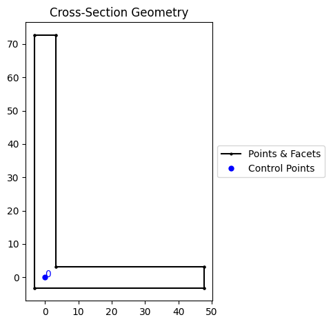
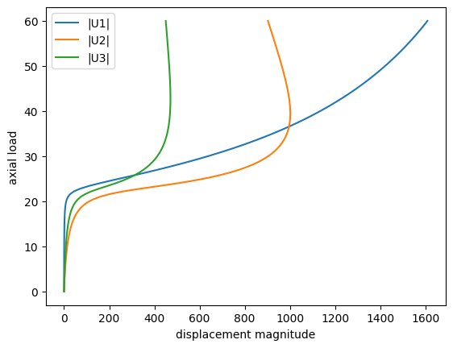
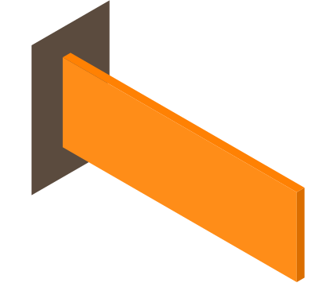
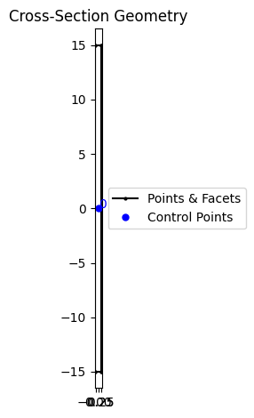
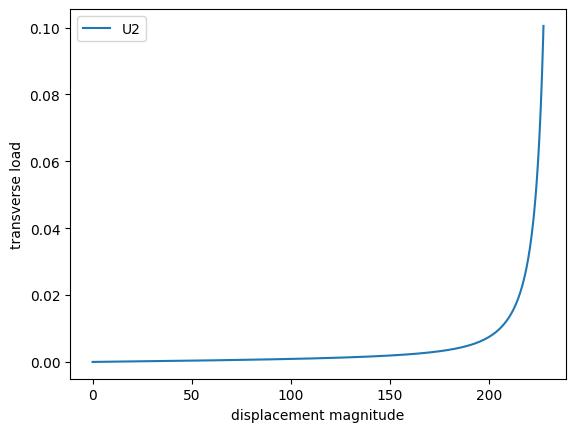
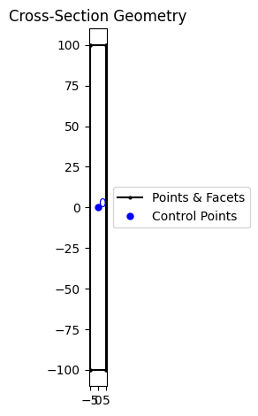
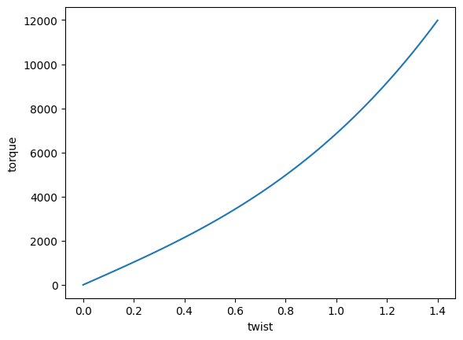

# B31OS

3D Displacement Based Beam With Torsion and Warping

* Number of Nodes: 2
* Number of DoFs: 7 (Translation, Translation, Translation, Rotation, Rotation, Rotation, Warping)

## Reference

1. [Distributed plasticity analysis of steel building structural systems](https://www.proquest.com/dissertations-theses/distributed-plasticity-analysis-steel-building/docview/304696456/se-2)

## Syntax

```
element B31OS (1) (2) (3) (4) (5) [6] [7]
# (1) int, unique element tag
# (2) int, node i
# (3) int, node j
# (4) int, section tag
# (5) int, orientation tag
# [6] int, number of integration points, default: 6
# [7] int, nonlinear geometry switch, default: false
```

## Remarks

1. The Lobatto integration is used by default. The number of integration points ranges from 3 to 20.
2. Please check [`orientation`](Orientation.md) for its definition.
3. To use the corotational formulation for nonlinearity, please attach a corotational
   transformation [`B3DOSC`](Orientation.md).
4. The reference also introduced a circumvention of membrane locking.
   It _**is**_ implemented in this element.
   The Hermite shape function is used for the interpolation of $$\phi$$.
5. A 3D OS section is required for this element.

The Alemdar's thesis contains a few typos. The following expressions are confirmed to be correct and used in the
implementation.

1. Eq. 7.12 (Eq. 7.63)
2. Eq. 7.41
3. Eq. 7.69

Use `S` to record section forces.
Each section contains six force components, namely axial force, bending moment about major axis, bending moment about
minor axis, Wagner stress resultant, bi-moment and St. Venant torsion.

$$
\begin{bmatrix}
P&M_z&M_y&W&B&T_{sv}
\end{bmatrix}
$$

If five integration points are used, the output file contains $$6\times5=30$$ columns.

At element level, the implementation transforms global nodal quantities to local elemental quantities, namely,

1. uniform axial
2. strong axis bending near node
3. strong axis bending far node
4. weak axis bending near node
5. weak axis bending far node
6. torsion near node
7. torsion far node
8. warping near node
9. warping far node

Those quantities are further interpolated to sectional quantities, namely,

$$
\begin{bmatrix}
u'&v'&w'&v''&w''&\phi&\phi'&\phi''&\theta_{z,i}&\theta_{z,j}&\theta_{y,i}&\theta_{y,j}
\end{bmatrix}
$$

Not all quantities would be used by section state determination.
See [Fibre3DOS](../../Section/SectionOS/Fibre3DOS.md) for further explanation.

## Example

See [this](../../../Example/Structural/Statics/thin-walled-section.md) example.

## Benchmarks

We present some benchmark problems for the B31OS element.

For further references, please see [this](https://doi.org/10.1016/j.engstruct.2021.112239) paper and the references therein.

### Angle Section



The cantilever beam with the angle section under an axial load applied at the shear centre.

#### Remarks

1. The section is not rotated.
2. The axial load is applied at the shear centre. The section is defined in the local coordinate system in which the shear centre is the origin.


```python
from subprocess import run
import shutil

from sectionproperties.post.fibre import to_fibre_section
from sectionproperties.pre import Geometry

b = 51
t = 6.5
a = 76
points = [(0, 0), (b, 0), (b, t), (t, t), (t, a), (0, a)]

facets = [(0, 1), (1, 2), (2, 3), (3, 4), (4, 5), (5, 0)]

geom = Geometry.from_points(
    points=points, facets=facets, control_points=[(t / 2, t / 2)]
).shift_section(-t / 2, -t / 2)
geom.create_mesh(mesh_sizes=2)
geom.plot_geometry()

to_fibre_section(geom, save_to='angle.sp', material_mapping={'default': 1})

pass
```


    

    


We use the following model to test.


```python
from matplotlib import pyplot as plt
from h5py import File

model = '''# cantilever beam with angle section
node 1 0 0 0
node 2 350 0 0
node 3 700 0 0
node 4 1050 0 0
node 5 1400 0 0

material ElasticOS 1 193.05 .3

file angle.sp

orientation B3DOSC 1 0. 0. -1.

element B31OS 1 1 2 1 1 6 1
element B31OS 2 2 3 1 1 6 1
element B31OS 3 3 4 1 1 6 1
element B31OS 4 4 5 1 1 6 1

fix2 1 E 1

cload 1 0 -60 1 5

hdf5recorder 1 Node U 5

step static 1
set ini_step_size 1E-2
set fixed_step_size true

converger RelIncreDisp 1 1E-10 20 1

analyze

save recorder 1

exit
'''

with open('angle.analysis.sp', 'w') as f:
    f.write(model)

executable = ['suanPan', 'suanPan.exe', 'suanpan']
is_run = False

for exe in executable:
    if shutil.which(exe):
        run([exe, '-f', 'angle.analysis.sp'])
        is_run = True
        break

if is_run:
    with File('R1-U.h5', 'r') as f:
        data = f['R1-U/R1-U5']
        U1 = -data[:, 1]
        U2 = data[:, 2]
        U3 = -data[:, 3]
        LOAD = data[:, 0] * 60
    plt.plot(U1, LOAD, label='|U1|')
    plt.plot(U2, LOAD, label='|U2|')
    plt.plot(U3, LOAD, label='|U3|')
    plt.xlabel('displacement magnitude')
    plt.ylabel('axial load')
    plt.legend()
    plt.show()
```


    

    


### Flat Bar




```python
from sectionproperties.pre.library import rectangular_section

geom = rectangular_section(d=30, b=.6).shift_section(-.3, -15)
geom.create_mesh(mesh_sizes=.05)
geom.plot_geometry()

to_fibre_section(geom, save_to='flat.sp', material_mapping={'default': 1})

pass
```


    

    


Here we use the arc-length algorithm to solve the problem.


```python
model = '''# cantilever beam with angle section
node 1 0 0 0
node 2 60 0 0
node 3 120 0 0
node 4 180 0 0
node 5 240 0 0

material ElasticOS 1 71.24 .31

file flat.sp

orientation B3DOSC 1 0. 0. -1.

element B31OS 1 1 2 1 1 6 1
element B31OS 2 2 3 1 1 6 1
element B31OS 3 3 4 1 1 6 1
element B31OS 4 4 5 1 1 6 1

fix2 1 E 1

hdf5recorder 1 Node U 5

refload 1 0 .001 2 5

step arclength 1
set ini_step_size 1
set fixed_step_size true

criterion MaxResistance 1 5 2 .1

converger RelIncreDisp 1 1E-10 20 1

analyze

save recorder 1

exit
'''

with open('flat.analysis.sp', 'w') as f:
    f.write(model)

is_run = False

for exe in executable:
    if shutil.which(exe):
        run([exe, '-f', 'flat.analysis.sp'])
        is_run = True
        break

if is_run:
    with File('R1-U.h5', 'r') as f:
        data = f['R1-U/R1-U5']
        U2 = data[:, 2]
        LOAD = data[:, 0] * .001  # reference load
    plt.plot(U2, LOAD, label='U2')
    plt.xlabel('displacement magnitude')
    plt.ylabel('transverse load')
    plt.legend()
    plt.show()
```


    

    


### Flat Bar Twisting


```python
geom = rectangular_section(d=200, b=10).shift_section(-5, -100)
geom.create_mesh(mesh_sizes=2)
geom.plot_geometry()

to_fibre_section(geom, save_to='flat2.sp', material_mapping={'default': 1})

pass
```


    

    


```python
model = '''# cantilever beam with angle section
node 1 0 0 0
node 2 250 0 0
node 3 500 0 0
node 4 750 0 0
node 5 1000 0 0

material ElasticOS 1 200 .25

file flat2.sp

orientation B3DOSC 1 0. 0. -1.

element B31OS 1 1 2 1 1 6 1
element B31OS 2 2 3 1 1 6 1
element B31OS 3 3 4 1 1 6 1
element B31OS 4 4 5 1 1 6 1

fix2 1 E 1

displacement 1 0 1.4 4 5

hdf5recorder 1 Node RF 5

step static 1
set ini_step_size 1E-2
set fixed_step_size true

converger RelIncreDisp 1 1E-10 20 1

analyze

save recorder 1

exit
'''

with open('flat2.analysis.sp', 'w') as f:
    f.write(model)

is_run = False

for exe in executable:
    if shutil.which(exe):
        run([exe, '-f', 'flat2.analysis.sp'])
        is_run = True
        break

if is_run:
    with File('R1-RF.h5', 'r') as f:
        data = f['R1-RF/R1-RF5']
        torque = data[:, 4]
        twist = data[:, 0] * 1.4
    plt.plot(twist, torque)
    plt.xlabel('twist')
    plt.ylabel('torque')
    plt.show()
```


    

    


