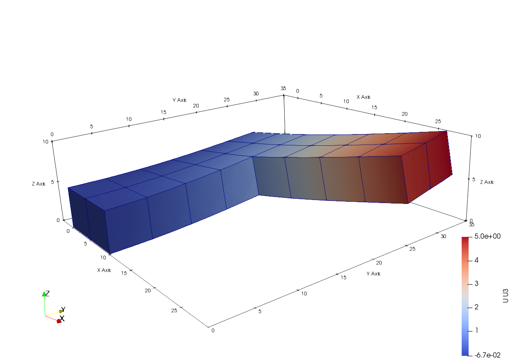

# C3D20

Second Order Cube/Brick

* Number of Nodes: 20
* Number of DoFs: 3 (All Translation)
* Supports Body Force
* Constant Consistent Mass Matrix With Same Order Integration

## Syntax

```
element C3D20 (1) (2...21) (22) [23] [24]
# (1) int, unique element tag
# (2...21) int, twenty corner nodes with conventional order
# (22) int, material tag
# [23] bool string, reduced integration scheme switch, default: true
# [24] bool string, nonlinear geometry switch, default: false
```

## Remarks

1. The nonlinearity is implemented by using total Lagrangian (TL) formulation, turn on the switch to use it.
2. The reduced integration uses 2nd order Gauss scheme.
3. The full integration uses 3rd order Irons scheme.

## Sample


