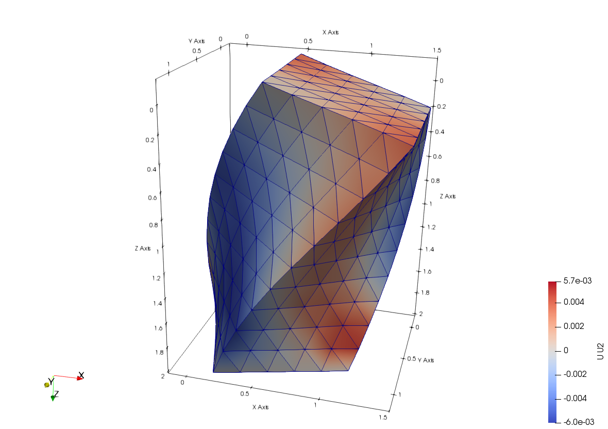

# C3D4

Linear Tetrahedral

* Number of Nodes: 4
* Number of DoFs: 3 (All Translation)
* Supports Body Force
* Integration Scheme: Single Point At Centre
* Constant Consistent Mass Matrix With Same Order Integration

## Syntax

```
element C3D4 (1) (2...5) (6) [7]
# (1) int, unique element tag
# (2...5) int, four corner nodes with conventional order
# (6) int, material tag
# [7] bool string, nonlinear geometry switch, default: false
```

## Remarks

1. The nonlinearity is implemented by using total Lagrangian (TL) formulation, turn on the switch to use it.

## Sample


