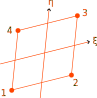

# PS

Pian-Sumihara Quadrilateral Element

* Number of Nodes: 4
* Number of DoFs: 2 (Translation, Translation)
* Supports Body Force
* Integration Scheme: 2nd Order Gauss
* Constant Consistent Mass Matrix With Same Order Integration



## References

1. [https://doi.org/10.1002/nme.1620200911](https://doi.org/10.1002/nme.1620200911)
2. [https://doi.org/10.1002/nme.6066](https://doi.org/10.1002/nme.6066)

## Syntax

```
element PS (1) (2...5) (6) [7]
# (1) int, unique element tag
# (2...5) int, node i, j, k, l
# (6) int, material tag
# [7] double, element thickness, default: 1.0
```

## Remarks

1. The original five-parameter stress field is used for stress interpolation.
2. The mixed framework is used to extend the original formulation to accommodate elastoplastic applications.
3. As there is no enhanced strain, no local iteration is required. Hence `PS` is faster than elements such as `QE2`.
