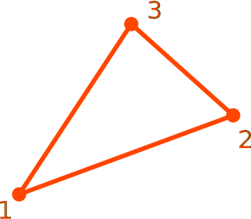

# CP3

Constant Strain Triangle

* Number of Nodes: 3
* Number of DoFs: 2 (Translation, Translation)
* Integration Scheme: Single Point Centre
* Supports Body Force
* Constant Consistent Mass Matrix With Same Order Integration



## Syntax

```
element CP3 (1) (2...4) (5) [6] [7]
# (1) int, unique element tag
# (2...4) int, node i, j, k
# (5) int, material tag
# [6] double, element thickness, default: 1.0
# [7] bool string, nonlinear geometry switch, default: false
```

## Remarks

* The `CP3` element resembles CPS3 and CPE3 elements in ABAQUS. It is a constant strain element.
* A single integration point at the center of the element is used for integration.
