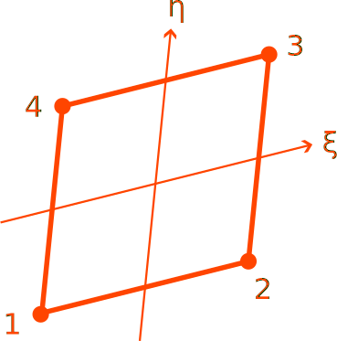

# CP4

Bilinear Quadrilateral

* Number of Nodes: 4
* Number of DoFs: 2 (Translation, Translation)
* Integration Scheme: 2nd Order Gauss (Full) or 1st Order Gauss (Reduced)
* Supports Body Force
* Constant Consistent Mass Matrix With Same Order Integration



## Syntax

```
element CP4 (1) (2...5) (6) [7] [8] [9]
# (1) int, unique element tag
# (2...5) int, node i, j, k, l
# (6) int, material tag
# [7] double, element thickness, default: 1.0
# [8] bool string, reduced integration switch, default: false
# [9] bool string, nonlinear geometry switch, default: false
```

## Remarks

* The `CP4` element resembles CPS4 and CPE4 elements in ABAQUS.
* The full integration scheme uses 2-by-2 Gauss scheme and the reduced integration uses a single integration point at
  the center of the element.
* The reduced integration scheme also imports anti-hourglassing technique.

For the hourglassing control, see [10.1016/0045-7825(84)90067-7](https://doi.org/10.1016/0045-7825(84)90067-7).
