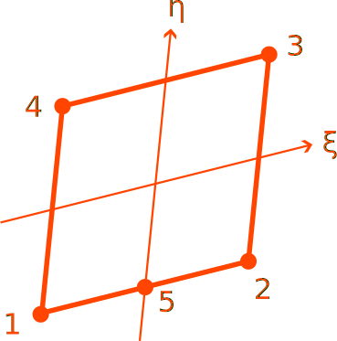

# CP5

Five-Point Quadrilateral

* Number of Nodes: 5
* Number of DoFs: 2 (Translation, Translation)
* Integration Scheme: 2nd Order Irons
* Supports Body Force
* Constant Consistent Mass Matrix With Same Order Integration



## Syntax

```
element CP5 (1) (2...6) (7) [8] [9]
# (1) int, unique element tag
# (2...6) int, node tags that define the element
# (7) int, material tag
# [8] double, element thickness, default: 1.0
# [9] bool string, nonlinear geometry switch, default: false
```
