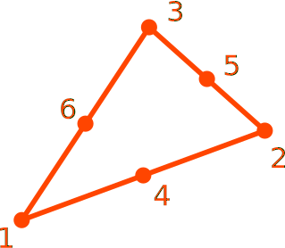

# CP6

Quadratic Triangle

* Number of Nodes: 6
* Number of DoFs: 2 (Translation, Translation)
* Integration Scheme: 3-Point Mid-edge
* Supports Body Force
* Constant Consistent Mass Matrix With Same Order Integration



## Syntax

```
element CP6 (1) (2...7) (8) [9] [10]
# (1) int, unique element tag
# (2...7) int, node tags that define the element
# (8) int, material tag
# [9] double, element thickness, default: 1.0
# [10] bool string, nonlinear geometry switch, default: false
```
