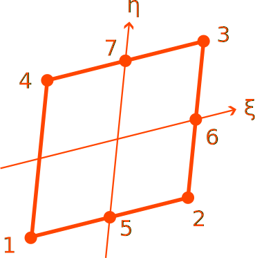

# CP7

Seven-Point Quadrilateral

* Number of Nodes: 7
* Number of DoFs: 2 (Translation, Translation)
* Integration Scheme: 2nd Order Irons
* Supports Body Force
* Constant Consistent Mass Matrix With Same Order Integration



## Syntax

```
element CP7 (1) (2...8) (9) [10] [11]
# (1) int, unique element tag
# (2...8) int, node tags that define the element
# (9) int, material tag
# [10] double, element thickness, default: 1.0
# [11] bool string, nonlinear geometry switch, default: false
```
