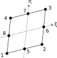

# CP8

Second Order Quadrilateral

* Number of Nodes: 8
* Number of DoFs: 2 (Translation, Translation)
* Supports Body Force
* Constant Consistent Mass Matrix With Same Order Integration



## Syntax

```
element CP8 (1) (2...9) (10) [11] [12] [13]
# (1) int, unique element tag
# (2...9) int, node 1 to node 8
# (10) int, material tag
# [11] double, element thickness, default: 1.0
# [12] bool string, reduced integration switch, default: false
# [13] bool string, nonlinear geometry switch, default: false
```

## Remarks

* The `CP8` element resembles CPS8, CPE8, CPS8R and CPE8R elements in ABAQUS.
* The full integration scheme uses 3-by-3 Gauss scheme and the reduced integration uses a 2-by-2 scheme.
