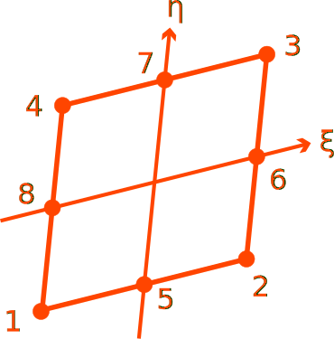

# PCPE8DC

Quadratic Quadrilateral With Pore Pressure (Drained)

* Number of Nodes: 8
* Number of DoFs: 4 (Solid Translation, Solid Translation, Fluid Translation, Fluid Translation)
* Supports Body Force
* Constant Consistent Mass Matrix With Same Order Integration



## Syntax

```
element PCPE8DC (1) (2...9) (10) (11) (12) (13) (14)
# (1) int, unique element tag
# (2...9) int, node i, j, k, l
# (10) int, solid material tag
# (11) int, fluid material tag
# (12) double, alpha
# (13) double, porosity n
# (14) double, permeability k
```

## Remarks

Only plane strain is supported. Plane stress does not make sense in geotechnical engineering.

For fluid phase, an isotropic fluid material can be provided, it mainly provides the bulk modulus of the fluid phase.
For example,

```
# material Fluid (tag) (bulk modulus) (density)
material Fluid 1 1000. 1E-2
```

The $$\alpha$$ parameter `(12)` is often close to unity for soils. The porosity $$n$$ ranges from zero to unity. The
isotropic permeability is assumed.

Interactions with other elements (with different arrangements of DoFs) can only be fulfilled via constraints.

## Recording

This model supports the following additional history variables to be recorded.

| variable label | physical meaning |
|----------------|------------------|
| PP             | pore pressure    |
