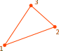

# DKT3

DKT Triangle Plate

* Number of Nodes: 3
* Number of DoFs: 3 (Translation, Translation, Rotation)



## Syntax

```
element DKT3 (1) (2...4) (5) (6) [7]
# (1) int, unique element tag
# (2...4) int, node i, j, k
# (5) int, material tag
# (6) double, thickness
# [7] int, number of integration points, default: 3
```
