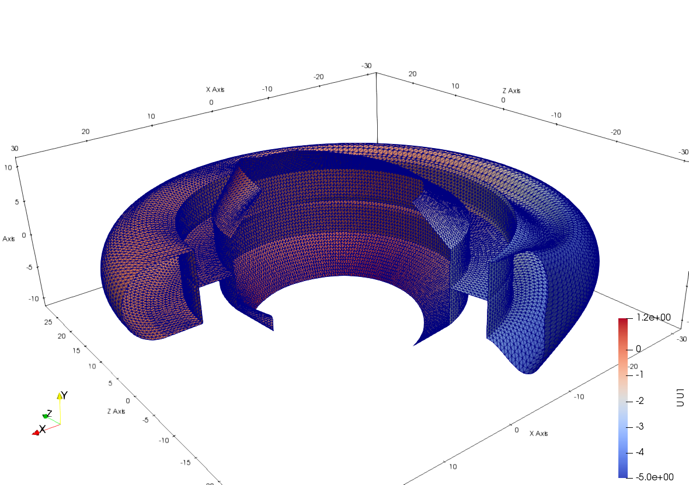

# DKTS3

DKT Triangle Shell

* Number of Nodes: 3
* Number of DoFs: 6 (Translation, Translation, Translation, Rotation, Rotation, Rotation)

## Syntax

```
element DKTS3 (1) (2...4) (5) (6) [7] [8]
# (1) int, unique element tag
# (2...4) int, node i, j, k
# (5) int, material tag
# (6) double, thickness
# [7] int, number of integration points, default: 3
# [8] bool, nonlinear geometry switch, default: false
```

## Remarks

1. If the nonlinear geometry switched on, the transformation between the global and local reference frames will depend
   on the current displacement. The nonlinear transformation is similar to the corotational transformation, and the
   local response is still linear. Thus, it follows "large displacement, small deformation" assumption.

## Sample

The model can be downloaded. [DKTS3.zip](DKTS3.zip)


