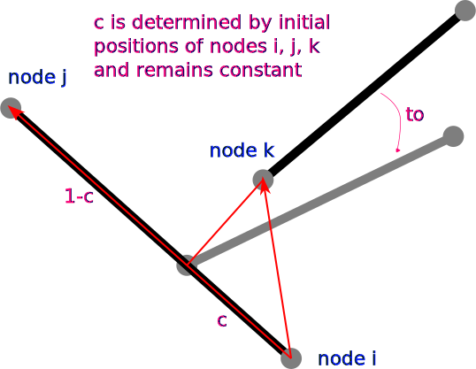

# TranslationConnector

Translation Connector Implemented via Penalty Method

## Syntax

### TranslationConnector2D

* Number of Nodes: 3
* Number of DoFs: 2 (Translation: UX, Translation: UY)

```text
element TranslationConnector2D (1) (2) (3) (4) [5]
# (1) int, unique element tag
# (2) int, node i
# (3) int, node j
# (4) int, node k
# [5] double, penalty factor
```

### TranslationConnector3D

* Number of Nodes: 3
* Number of DoFs: 3 (Translation: UX, Translation: UY, Translation: UZ)

```text
element TranslationConnector3D (1) (2) (3) (4) [5]
# (1) int, unique element tag
# (2) int, node i
# (3) int, node j
# (4) int, node k
# [5] double, penalty factor
```

## Theory

The schematic is shown as follows.



The initial position of node $$k$$ is not necessarily on the line defined by nodes $$i$$ and $$j$$.

The `TranslationConnector` will pull node $$k$$ to the (closest point of) line defined by nodes $$i$$ and $$j$$.

The ratio $$c$$ is computed according to the initial positions and remains constant during the analysis.
