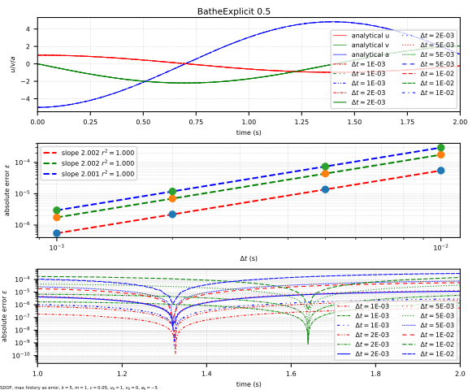

# BatheExplicit

Second order explicit time integration method using Noh-Bathe two-step scheme.

The Noh-Bathe scheme has a better energy dispersion behaviour.

References:

1. [10.1016/j.compstruc.2013.06.007](https://doi.org/10.1016/j.compstruc.2013.06.007)

## Syntax

```text
integrator BatheExplicit (1) [2]
# (1) int, unique integrator tag
# [2] double, spectral radius, \rho_\infty, default: 0.5
```

## Remarks

If the model is linear elastic, it is possible to indicate using

```text
set linear_system true
```

to speed up the computation.

## Accuracy Analysis




