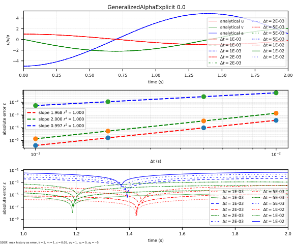

# GeneralizedAlphaExplicit

Explicit version of the [GeneralizedAlpha](../Implicit/GeneralizedAlpha.md) integrator.

References:

1. [10.1002/nme.6574](https://doi.org/10.1002/nme.6574)

## Syntax

```text
integrator GeneralizedAlphaExplicit (1) [2]
integrator GeneralisedAlphaExplicit (1) [2]
# (1) int, unique integrator tag
# [2] double, spectral radius, \rho_\infty, default: 0.5
```

## Remarks

If the model is linear elastic, it is possible to indicate using

```text
set linear_system true
```

to speed up the computation.

!!! Warning
    When $$\rho_\infty<1$$, the algorithm extrapolates.

## Accuracy Analysis




