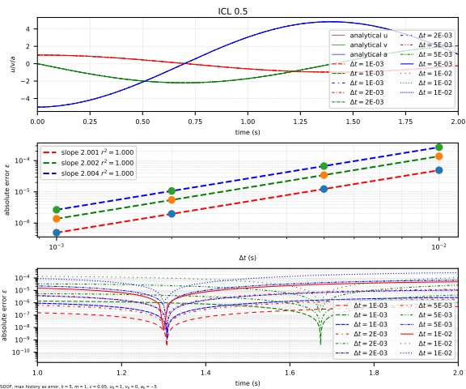
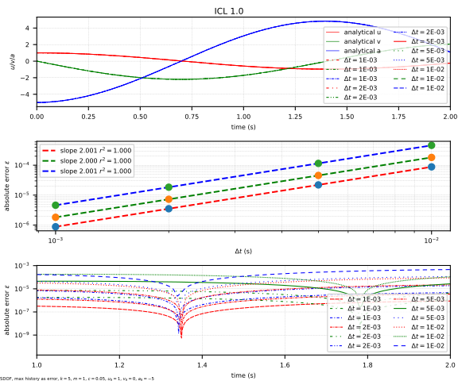

# ICL

Improved Chung and Lee's method

References:

1. [10.1002/nme.6574](https://doi.org/10.1002/nme.6574)
2. [10.1002/nme.6054](https://doi.org/10.1002/nme.6054)
3. [10.1002/nme.1620372303](https://doi.org/10.1002/nme.1620372303)

## Syntax

```text
integrator ICL (1) [2]
# (1) int, unique integrator tag
# [2] double, spectral radius, \rho_b, default: 0.5
```

## Remarks

The following constraint applies.

$$
0.5\leq\rho_b\leq1.0.
$$

If the model is linear elastic, it is possible to indicate using

```text
set linear_system true
```

to speed up the computation.

## Accuracy Analysis



