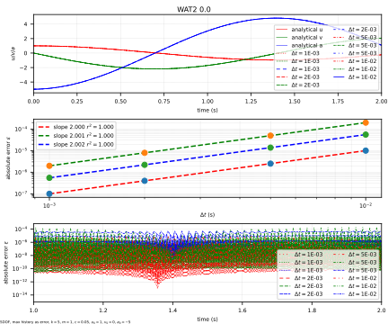
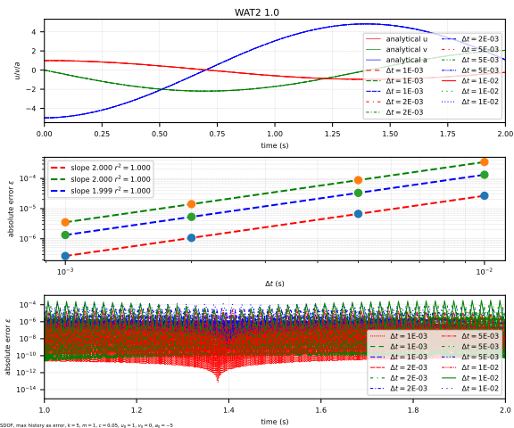
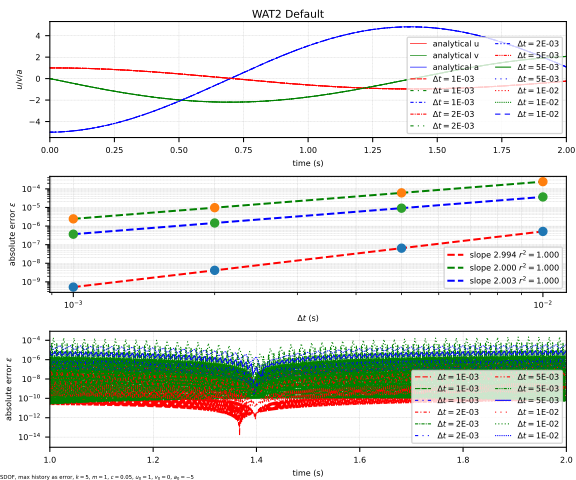

# WAT2

The generalized explicit Runge-Kutta-Nyström framework with the second scheme presented in [10.1002/nme.7658](https://doi.org/10.1002/nme.7658).
It is called WAT2 because it is the second scheme by the authors Wang, Adams and Tamma.

References:

1. [10.1002/nme.7658](https://doi.org/10.1002/nme.7658)

## Syntax

```text
integrator WAT2 (1) [2]
# (1) int, unique integrator tag
# [2] double, parameter, default: 1/3
```

## Remarks

The parameter $$r$$ is a ratio between zero and unity.
It yields $$C_1$$ ranging from $$0.3$$ to $$0.4$$ as recommended in the reference.

$$
C_1=0.3+0.1r.
$$

The default value of $$r=1/3$$ yields $$C_1=1/3$$.

It is a two-stage method implemented in an alternating fashion.

!!! Warning
    It is claimed to have a third-order accuracy for displacement and velocity.
    However, it is only valid for results at the end of the time step (the second stage after applying the corrector).
    For the results at the end of the first stage, it is only second-order accurate.
    For nonlinear problems, the error introduced in the first stage will be carried over to the history of the material model, thus affecting the results of the second stage.
    The overall accuracy can at best be second-order for nonlinear problems.

## Accuracy Analysis




