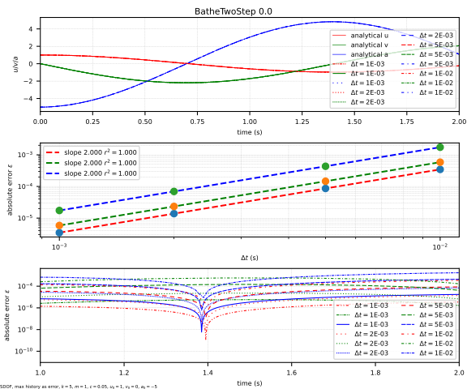
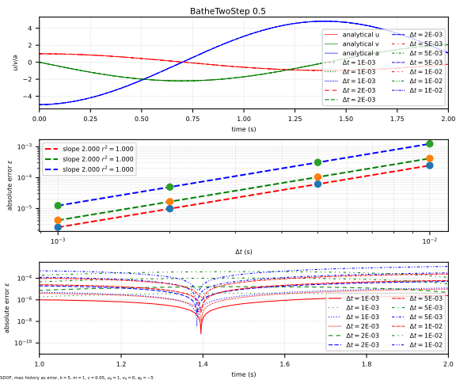

# BatheTwoStep

Starting from version 2.7, customisation of spectral radius ($$\rho_\infty$$) and sub-step size ($$\gamma$$) is supported.

The algorithm is known to be able to conserve energy and momentum.

References:

1. [10.1016/j.compstruc.2006.09.004](https://doi.org/10.1016/j.compstruc.2006.09.004)
2. [10.1016/j.compstruc.2018.11.001](https://doi.org/10.1016/j.compstruc.2018.11.001)

The implementation follows the original algorithm. The only difference is the step size defined in `suanPan` is the mean step size of two sub-step sizes, that is $$\Delta{}t/2$$ in the references.

For further discussions on this type of algorithm, one can check the following references.

1. [10.1007/s11071-023-09065-7](https://doi.org/10.1007/s11071-023-09065-7)

## Syntax

```
integrator BatheTwoStep (1) [2] [3]
# (1) int, unique integrator tag
# [2] double, spectral radius, \rho_\infty, default: 0
# [2] double, sub-step size, gamma, default: 0.5
```

Using `integrator BatheTwoStep (1)` with two optional parameters omitted gives the same results as in versions prior 
to version 2.7.

The spectral radius $$\rho_\infty$$ ranges from 0 to 1, both ends **inclusive**.

The sub-step size $$\gamma$$ ranges from 0 to 1, both ends **exclusive**.

## Theory

### The First Sub-step

For trapezoidal rule,

$$
v_{n+1}=v_n+\dfrac{\gamma\Delta{}t}{2}\left(a_n+a_{n+1}\right),
$$

$$
u_{n+1}=u_n+\dfrac{\gamma\Delta{}t}{2}\left(v_n+v_{n+1}\right).
$$

Then,

$$
u_{n+1}=u_n+\dfrac{\gamma\Delta{}t}{2}\left(v_n+v_n+\dfrac{\gamma\Delta{}t}{2}\left(a_n+a_{n+1}\right)\right),
$$

$$
\Delta{}u=\gamma\Delta{}tv_n+\dfrac{\gamma^2\Delta{}t^2}{4}a_n+\dfrac{\gamma^2\Delta{}t^2}{4}a_{n+1}.
$$

One could obtain

$$
a_{n+1}=\dfrac{4}{\gamma^2\Delta{}t^2}\Delta{}u-\dfrac{4}{\gamma\Delta{}t}v_n-a_n,\qquad
\Delta{}a=\dfrac{4}{\gamma^2\Delta{}t^2}\Delta{}u-\dfrac{4}{\gamma\Delta{}t}v_n-2a_n,
$$

$$
v_{n+1}=\dfrac{2}{\gamma\Delta{}t}\Delta{}u-v_n,\qquad
\Delta{}v=\dfrac{2}{\gamma\Delta{}t}\Delta{}u-2v_n.
$$

The effective stiffness is then

$$
\bar{K}=K+\dfrac{2}{\gamma\Delta{}t}C+\dfrac{4}{\gamma^2\Delta{}t^2}M.
$$

### The Second Sub-step

The second step is computed by

$$
v_{n+2}=v_n+\Delta{}t\left(q_0a_n+q_1a_{n+1}+q_2a_{n+2}\right),
$$

$$
u_{n+2}=u_n+\Delta{}t\left(q_0v_n+q_1v_{n+1}+q_2v_{n+2}\right).
$$

The parameters satisfy $$q_0+q_1+q_2=1$$, and

$$
q_1=\dfrac{\rho_\infty+1}{2\gamma\left(\rho_\infty-1\right)+4},\qquad
q_2=0.5-\gamma{}q_1.
$$

Hence,

$$
a_{n+2}=\dfrac{v_{n+2}-v_n}{q_2\Delta{}t}-\dfrac{q_0}{q_2}a_n-\dfrac{q_1}{q_2}a_{n+1},
$$

$$
v_{n+2}=\dfrac{u_{n+2}-u_n}{q_2\Delta{}t}-\dfrac{q_0}{q_2}v_n-\dfrac{q_1}{q_2}v_{n+1}.
$$

The effective stiffness is then

$$
\bar{K}=K+\dfrac{1}{q_2\Delta{}t}C+\dfrac{1}{q_2^2\Delta{}t^2}M.
$$

## Accuracy Analysis




